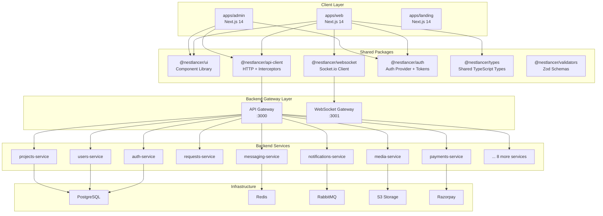
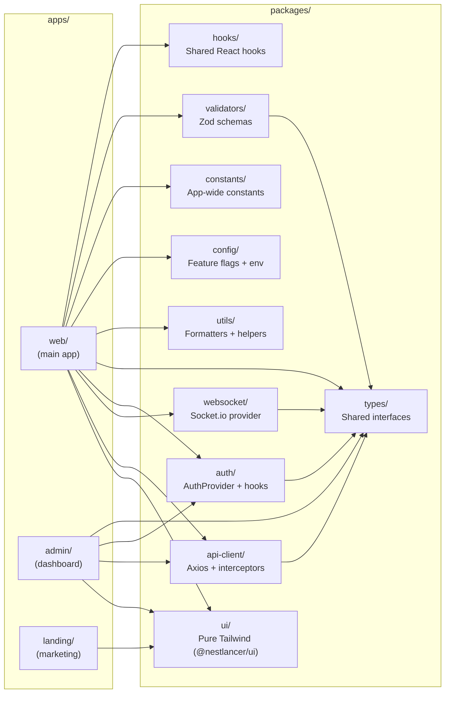
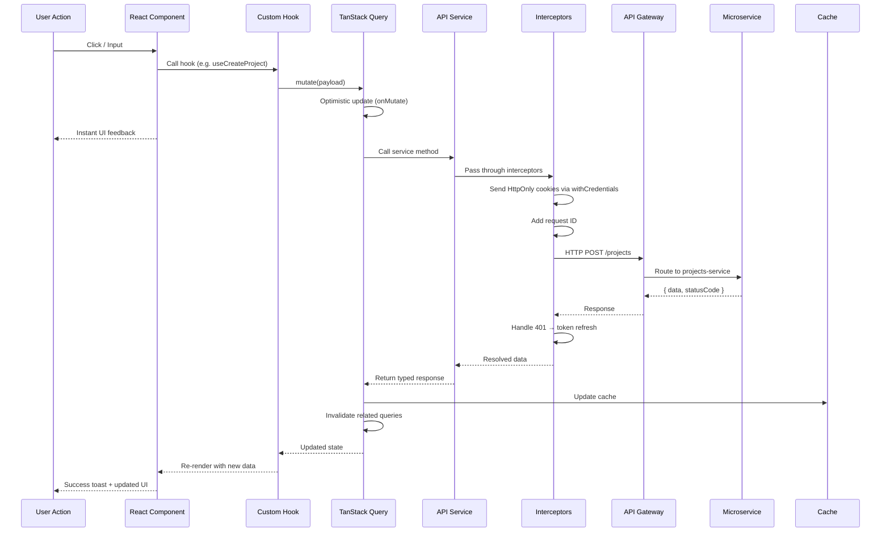
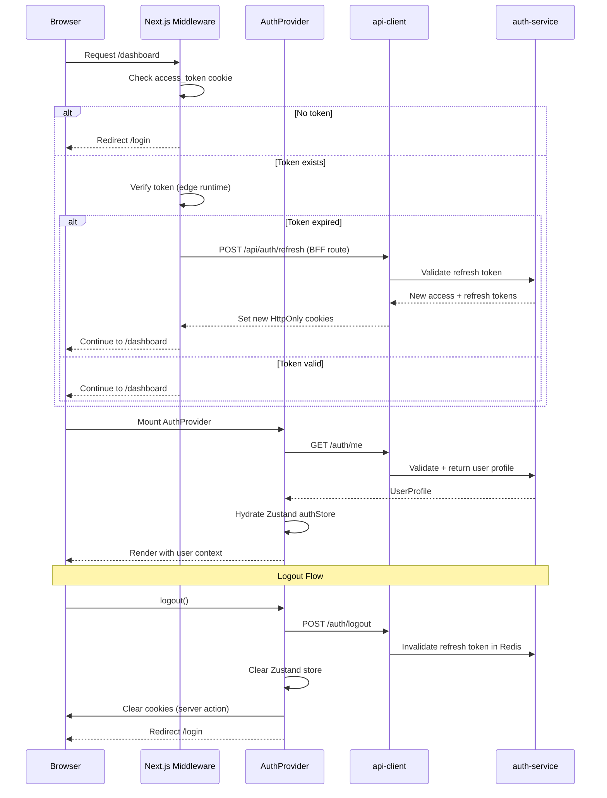
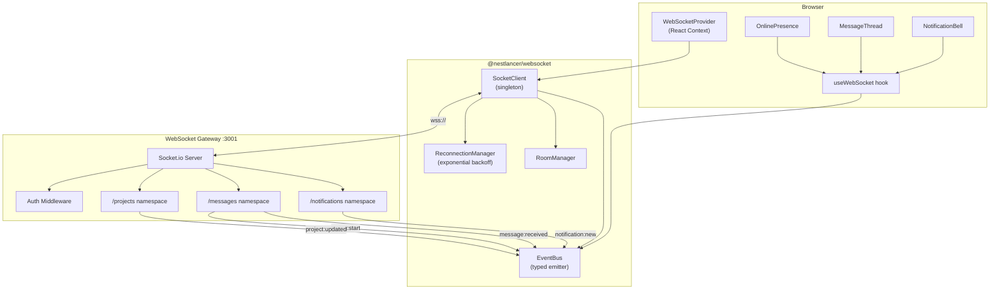
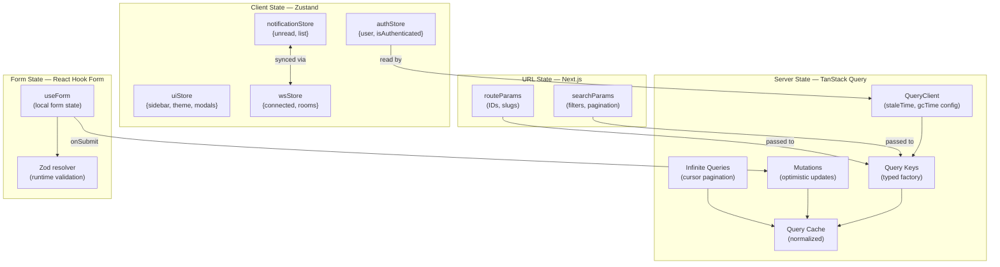
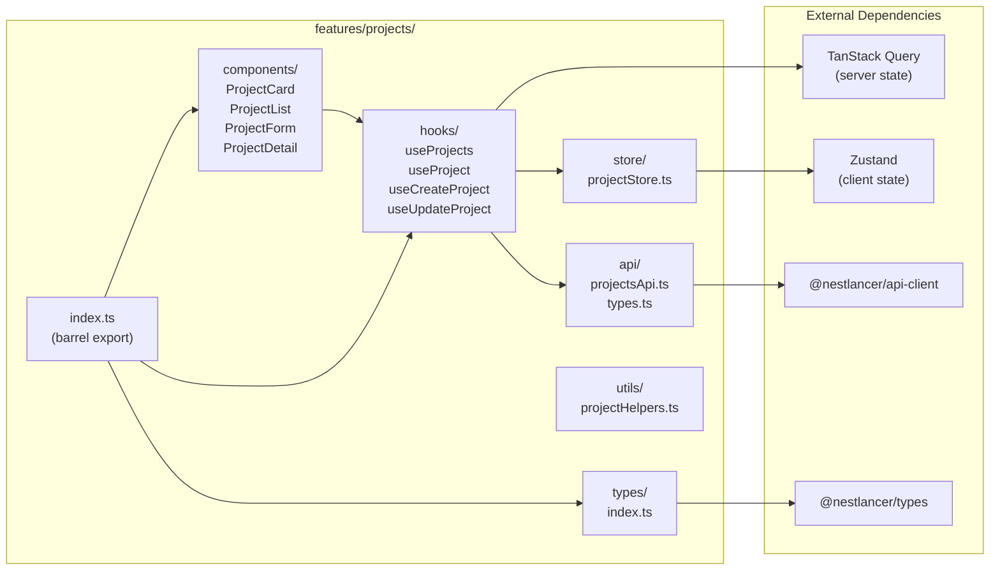
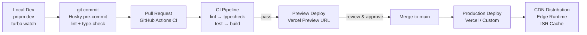
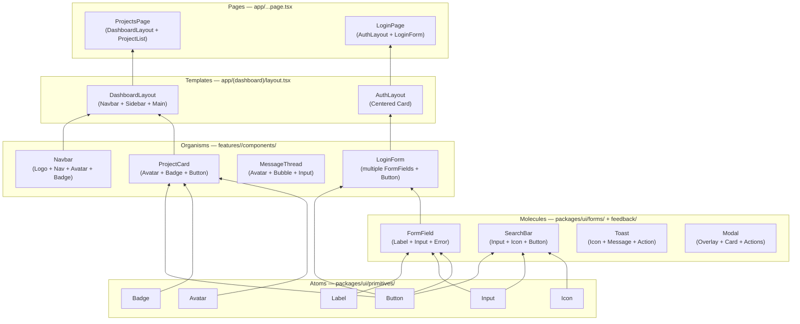
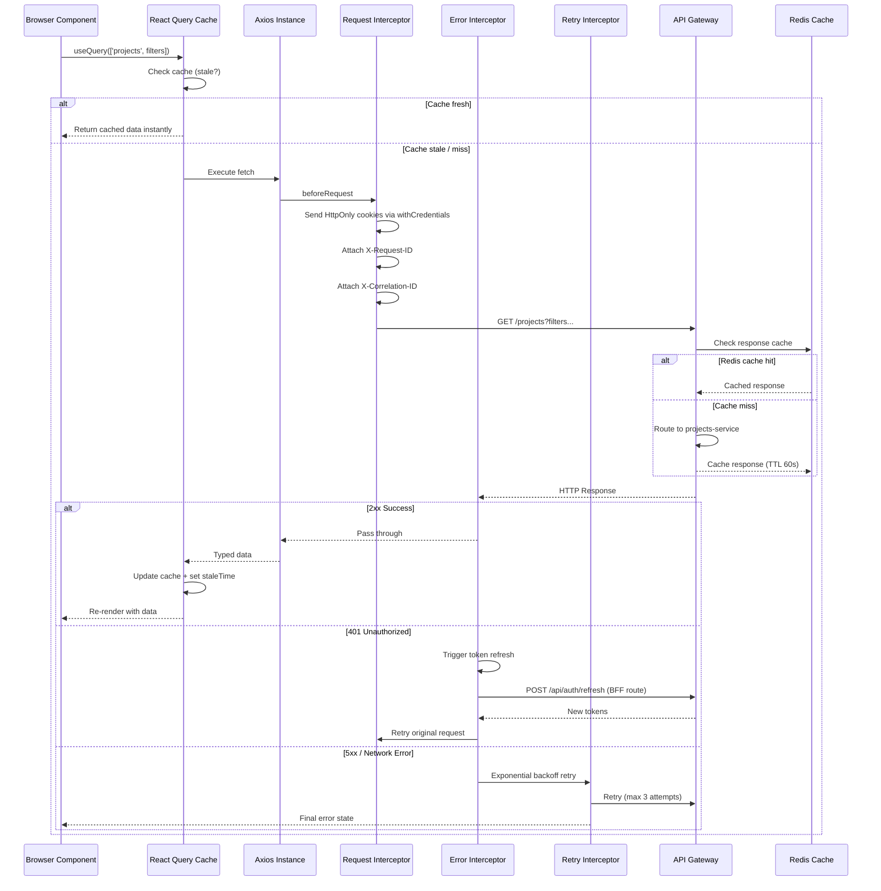

<div align="center">

# Nestlancer Frontend Architecture

</div>

---

## 📖 Table of Contents

- [1. Executive Summary](#1-executive-summary)
- [2. Architecture Diagrams](#2-architecture-diagrams)
- [3. Technology Stack](#3-technology-stack)
- [4. Complete Folder Structure](#4-complete-folder-structure)
- [5. Architecture Decision Records](#5-architecture-decision-records)
- [6. Core Configuration Files](#6-core-configuration-files)
- [7. Feature Module Template](#7-feature-module-template)
- [8. Shared Packages Implementation](#8-shared-packages-implementation)
- [9. API Client Architecture](#9-api-client-architecture)
- [10. State Management Setup](#10-state-management-setup)
- [11. Routing Structure](#11-routing-structure)
- [12. Testing Strategy](#12-testing-strategy)
- [13. Real-Time Features](#13-real-time-features)
- [14. File Upload System](#14-file-upload-system)
- [15. Payment Integration](#15-payment-integration)
- [16. Development Workflow Guide](#16-development-workflow-guide)
- [17. Component Library Structure](#17-component-library-structure)
- [18. Performance Optimization](#18-performance-optimization)
- [19. Security Implementation](#19-security-implementation)
- [20. Accessibility Checklist](#20-accessibility-checklist)

---

## 📖 Table of Contents

1. [Executive Summary](#1-executive-summary)
2. [Architecture Diagrams](#2-architecture-diagrams)
3. [Technology Stack](#3-technology-stack)
4. [Complete Folder Structure](#4-complete-folder-structure)
5. [Architecture Decision Records](#5-architecture-decision-records)
6. [Core Configuration Files](#6-core-configuration-files)
7. [Feature Module Template (Auth)](#7-feature-module-template)
8. [Shared Packages Implementation](#8-shared-packages-implementation)
9. [API Client Architecture](#9-api-client-architecture)
10. [State Management Setup](#10-state-management-setup)
11. [Routing Structure](#11-routing-structure)
12. [Testing Strategy](#12-testing-strategy)
13. [Real-Time Features](#13-real-time-features)
14. [File Upload System](#14-file-upload-system)
15. [Payment Integration](#15-payment-integration)
16. [Development Workflow Guide](#16-development-workflow-guide)
17. [Component Library Structure](#17-component-library-structure)
18. [Performance Optimization](#18-performance-optimization)
19. [Security Implementation](#19-security-implementation)
20. [Accessibility Checklist](#20-accessibility-checklist)

---

## 1. Executive Summary

### Architecture Philosophy

Nestlancer's frontend is designed as a **feature-driven, domain-aligned monorepo** that mirrors the backend's microservices topology. Each of the 15 backend services maps to a corresponding frontend feature module — ensuring a clean separation of concerns where UI concerns, data fetching, state, and business logic are co-located by domain rather than scattered across technical layers. This philosophy, pioneered at companies like Linear and Vercel, dramatically reduces cognitive overhead when a developer needs to touch any particular feature.

The architecture embraces **React Server Components (RSC)** as the default rendering primitive, pushing data fetching to the server where it belongs — closer to the database, with zero client bundle cost. Interactive islands use a TanStack Query + Zustand hybrid: server state (API data) lives in TanStack Query's normalized cache with smart invalidation, while ephemeral UI state (modals, sidebar, theme) lives in tiny Zustand slices. This eliminates the most common Redux anti-pattern of duplicating server data into client state.

### Core Technology Choices

| Concern                | Choice                               | Version         |
| :--------------------- | :----------------------------------- | :-------------- |
| Meta-Framework         | Next.js (App Router)                 | 14.2+           |
| Language               | TypeScript                           | 5.4+            |
| Monorepo Orchestration | Turborepo                            | 2.x             |
| Package Manager        | pnpm                                 | 9.x             |
| UI Components          | Pure Tailwind CSS (`@nestlancer/ui`) | 3.4+            |
| Styling                | Tailwind CSS                         | 3.4+            |
| Server State           | TanStack Query                       | 5.x             |
| Client State           | Zustand                              | 4.x             |
| Forms                  | React Hook Form + Zod                | 7.x / 3.x       |
| HTTP Client            | Axios                                | 1.x             |
| WebSocket              | Socket.io-client                     | 4.x             |
| Testing                | Vitest + Playwright + MSW            | 1.x / 1.x / 2.x |

### Key Architectural Patterns

- **Turborepo monorepo** with three apps (`web`, `admin`, `landing`) sharing 10 internal packages
- **Feature-first folder structure** — all code for a domain lives in `features/<domain>/`
- **RSC-first rendering** — data fetching in Server Components, interactivity in Client Components
- **Collocated API layer** — each feature owns its API calls in `features/<domain>/api/`
- **Type-safe API contracts** — Orval generates typed Axios clients from the gateway merged OpenAPI spec; TanStack Query hooks are generated for the **blog** pilot tag, with other domains on hand-written services until migrated
- **Optimistic mutations** — TanStack Query's `onMutate` for instant UI feedback
- **Cookie-based token storage** — HttpOnly cookies for access/refresh tokens (XSS-safe)

### Scalability Approach

The monorepo structure allows independent versioning and deployment of apps while sharing packages. Turborepo's remote caching means CI builds only rebuild changed packages. Feature flags (via `@nestlancer/config`) enable progressive rollouts. The design supports adding a fourth app (e.g., `mobile-web` or `embed`) without restructuring existing code.

---

## 2. Architecture Diagrams

### 2.1 High-Level System Architecture



### 2.2 Application Architecture (Monorepo)



### 2.3 Data Flow Diagram



### 2.4 Authentication Flow



### 2.5 WebSocket Architecture



### 2.6 State Management Flow



### 2.7 Feature Module Structure



### 2.8 Build & Deploy Pipeline



### 2.9 Component Hierarchy (Atomic Design)



### 2.10 Request Lifecycle



### 2.11 Wireframes Coverage Map

Wireframes are maintained under `docs/architecture/diagrams/wireframes` and currently cover public, user, and admin journeys.

- Source of truth index: `docs/architecture/diagrams/wireframes/README.md`
- Public flows: `docs/architecture/diagrams/wireframes/public`
- User dashboard flows: `docs/architecture/diagrams/wireframes/user`
- Admin/control-plane flows: `docs/architecture/diagrams/wireframes/admin`

Keep architecture updates and wireframe updates in the same PR when a user flow changes.

---

## 3. Technology Stack

| Category        | Technology                           | Version | Justification                                          |
| :-------------- | :----------------------------------- | :------ | :----------------------------------------------------- |
| Meta-Framework  | Next.js                              | 14.2+   | App Router, RSC, Streaming, Server Actions             |
| Language        | TypeScript                           | 5.4+    | Full type safety, branded types, const enums           |
| Monorepo        | Turborepo                            | 2.x     | Remote caching, task graph, incremental builds         |
| Package Manager | pnpm                                 | 9.x     | Disk efficiency, strict hoisting, workspace protocol   |
| UI Base         | Pure Tailwind CSS (`@nestlancer/ui`) | 3.4+    | Native HTML + utility classes; no third-party UI kits  |
| Styling         | Tailwind CSS                         | 3.4+    | Utility-first, design token CSS variables, JIT         |
| Server State    | TanStack Query                       | 5.x     | Cache, mutations, optimistic updates, infinite queries |
| Client State    | Zustand                              | 4.x     | Minimal boilerplate, devtools, Immer support           |
| Forms           | React Hook Form                      | 7.x     | Uncontrolled inputs, minimal re-renders                |
| Validation      | Zod                                  | 3.x     | Runtime + compile-time, infer types from schema        |
| HTTP Client     | Axios                                | 1.x     | Interceptors, cancellation, upload progress            |
| WebSocket       | Socket.io-client                     | 4.x     | Matches backend, auto-reconnect, namespaces            |
| Tables          | TanStack Table                       | 8.x     | Headless, virtualized, sorting/filtering               |
| Charts          | Recharts                             | 2.x     | Composable, SVG-based, responsive                      |
| Date Handling   | date-fns                             | 3.x     | Tree-shakeable, immutable, locale support              |
| Icons           | Lucide React                         | Latest  | Consistent 24px grid, tree-shakeable                   |
| Animations      | Framer Motion                        | 11.x    | Production-grade, layout animations                    |
| Unit Testing    | Vitest                               | 1.x     | Vite-native, Jest-compatible API, watch mode           |
| E2E Testing     | Playwright                           | 1.x     | Multi-browser, auto-wait, trace viewer                 |
| API Mocking     | MSW                                  | 2.x     | Service worker interception, identical in test + dev   |
| Linting         | ESLint                               | 8.x     | next/core-web-vitals + custom rules                    |
| Formatting      | Prettier                             | 3.x     | Opinionated, zero config, pre-commit enforced          |
| Git Hooks       | Husky                                | 9.x     | Pre-commit lint + type-check                           |
| Commits         | Commitlint                           | 19.x    | Conventional commits for semantic release              |
| Error Tracking  | Sentry                               | 7.x     | Source maps, session replay, performance               |
| Analytics       | PostHog                              | Latest  | Self-hostable, feature flags, A/B testing              |

---

## 4. Complete Folder Structure

```
nestlancer-frontend/
├── .github/
│   ├── workflows/
│   │   ├── ci.yml                    # Lint, typecheck, test, build
│   │   ├── deploy-preview.yml        # Deploy PR previews
│   │   └── deploy-production.yml     # Deploy main branch
│   └── PULL_REQUEST_TEMPLATE.md
│
├── .husky/
│   ├── pre-commit                    # lint-staged + tsc
│   └── commit-msg                   # commitlint
│
├── .vscode/
│   ├── extensions.json               # Recommended extensions
│   └── settings.json                 # Workspace settings
│
├── apps/
│   ├── web/                          # Main application (Nestlancer platform)
│   │   ├── public/
│   │   │   ├── fonts/
│   │   │   ├── images/
│   │   │   └── icons/
│   │   ├── src/
│   │   │   ├── app/                  # Next.js App Router
│   │   │   │   ├── (auth)/           # Route group - unauthenticated
│   │   │   │   │   ├── login/
│   │   │   │   │   │   ├── page.tsx
│   │   │   │   │   │   └── loading.tsx
│   │   │   │   │   ├── register/
│   │   │   │   │   │   ├── page.tsx
│   │   │   │   │   │   └── loading.tsx
│   │   │   │   │   ├── forgot-password/
│   │   │   │   │   │   └── page.tsx
│   │   │   │   │   ├── reset-password/
│   │   │   │   │   │   └── page.tsx
│   │   │   │   │   ├── verify-email/
│   │   │   │   │   │   └── page.tsx
│   │   │   │   │   └── layout.tsx    # Auth layout (centered card)
│   │   │   │   │
│   │   │   │   ├── (dashboard)/      # Route group - authenticated
│   │   │   │   │   ├── dashboard/
│   │   │   │   │   │   ├── page.tsx  # RSC - fetch overview data
│   │   │   │   │   │   └── loading.tsx
│   │   │   │   │   ├── projects/
│   │   │   │   │   │   ├── page.tsx
│   │   │   │   │   │   ├── loading.tsx
│   │   │   │   │   │   ├── [id]/
│   │   │   │   │   │   │   ├── page.tsx
│   │   │   │   │   │   │   ├── loading.tsx
│   │   │   │   │   │   │   └── not-found.tsx
│   │   │   │   │   │   └── new/
│   │   │   │   │   │       └── page.tsx
│   │   │   │   │   ├── requests/
│   │   │   │   │   │   ├── page.tsx
│   │   │   │   │   │   ├── loading.tsx
│   │   │   │   │   │   ├── [id]/
│   │   │   │   │   │   │   └── page.tsx
│   │   │   │   │   │   └── new/
│   │   │   │   │   │       └── page.tsx
│   │   │   │   │   ├── quotes/
│   │   │   │   │   │   ├── page.tsx
│   │   │   │   │   │   └── [id]/
│   │   │   │   │   │       └── page.tsx
│   │   │   │   │   ├── messages/
│   │   │   │   │   │   ├── page.tsx
│   │   │   │   │   │   ├── loading.tsx
│   │   │   │   │   │   └── [conversationId]/
│   │   │   │   │   │       └── page.tsx
│   │   │   │   │   ├── notifications/
│   │   │   │   │   │   └── page.tsx
│   │   │   │   │   ├── payments/
│   │   │   │   │   │   ├── page.tsx
│   │   │   │   │   │   ├── [id]/
│   │   │   │   │   │   │   └── page.tsx
│   │   │   │   │   │   └── invoice/
│   │   │   │   │   │       └── [id]/
│   │   │   │   │   │           └── page.tsx
│   │   │   │   │   ├── portfolio/
│   │   │   │   │   │   ├── page.tsx
│   │   │   │   │   │   └── [id]/
│   │   │   │   │   │       └── page.tsx
│   │   │   │   │   ├── profile/
│   │   │   │   │   │   ├── page.tsx
│   │   │   │   │   │   └── edit/
│   │   │   │   │   │       └── page.tsx
│   │   │   │   │   ├── settings/
│   │   │   │   │   │   ├── page.tsx
│   │   │   │   │   │   ├── account/
│   │   │   │   │   │   │   └── page.tsx
│   │   │   │   │   │   ├── security/
│   │   │   │   │   │   │   └── page.tsx
│   │   │   │   │   │   └── notifications/
│   │   │   │   │   │       └── page.tsx
│   │   │   │   │   └── layout.tsx    # Dashboard layout (sidebar + navbar)
│   │   │   │   │
│   │   │   │   ├── (public)/         # Route group - public pages
│   │   │   │   │   ├── blog/
│   │   │   │   │   │   ├── page.tsx  # ISR blog listing
│   │   │   │   │   │   └── [slug]/
│   │   │   │   │   │       └── page.tsx # ISR blog post
│   │   │   │   │   ├── freelancers/
│   │   │   │   │   │   ├── page.tsx
│   │   │   │   │   │   └── [username]/
│   │   │   │   │   │       └── page.tsx
│   │   │   │   │   └── layout.tsx
│   │   │   │   │
│   │   │   │   ├── api/              # Next.js API Routes (BFF)
│   │   │   │   │   ├── auth/
│   │   │   │   │   │   ├── callback/
│   │   │   │   │   │   │   └── route.ts
│   │   │   │   │   │   └── refresh/
│   │   │   │   │   │       └── route.ts
│   │   │   │   │   ├── upload/
│   │   │   │   │   │   └── route.ts  # Presigned URL generation
│   │   │   │   │   └── webhooks/
│   │   │   │   │       └── razorpay/
│   │   │   │   │           └── route.ts
│   │   │   │   │
│   │   │   │   ├── layout.tsx        # Root layout (providers)
│   │   │   │   ├── page.tsx          # Home / redirect
│   │   │   │   ├── not-found.tsx
│   │   │   │   ├── error.tsx
│   │   │   │   └── globals.css
│   │   │   │
│   │   │   ├── features/             # Domain feature modules
│   │   │   │   ├── auth/
│   │   │   │   │   ├── components/
│   │   │   │   │   │   ├── LoginForm.tsx
│   │   │   │   │   │   ├── RegisterForm.tsx
│   │   │   │   │   │   ├── TwoFactorPrompt.tsx
│   │   │   │   │   │   ├── PasswordResetForm.tsx
│   │   │   │   │   │   └── SocialLogin.tsx
│   │   │   │   │   ├── hooks/
│   │   │   │   │   │   ├── useAuth.ts
│   │   │   │   │   │   ├── useLogin.ts
│   │   │   │   │   │   ├── useRegister.ts
│   │   │   │   │   │   └── use2FA.ts
│   │   │   │   │   ├── api/
│   │   │   │   │   │   ├── authApi.ts
│   │   │   │   │   │   └── types.ts
│   │   │   │   │   ├── store/
│   │   │   │   │   │   └── authStore.ts
│   │   │   │   │   ├── types/
│   │   │   │   │   │   └── index.ts
│   │   │   │   │   ├── utils/
│   │   │   │   │   │   └── tokenStorage.ts
│   │   │   │   │   └── index.ts
│   │   │   │   │
│   │   │   │   ├── projects/
│   │   │   │   │   ├── components/
│   │   │   │   │   │   ├── ProjectCard.tsx
│   │   │   │   │   │   ├── ProjectList.tsx
│   │   │   │   │   │   ├── ProjectForm.tsx
│   │   │   │   │   │   ├── ProjectDetail.tsx
│   │   │   │   │   │   ├── ProjectStatus.tsx
│   │   │   │   │   │   └── MilestoneList.tsx
│   │   │   │   │   ├── hooks/
│   │   │   │   │   │   ├── useProjects.ts
│   │   │   │   │   │   ├── useProject.ts
│   │   │   │   │   │   ├── useCreateProject.ts
│   │   │   │   │   │   └── useUpdateProject.ts
│   │   │   │   │   ├── api/
│   │   │   │   │   │   ├── projectsApi.ts
│   │   │   │   │   │   └── types.ts
│   │   │   │   │   ├── store/
│   │   │   │   │   │   └── projectStore.ts
│   │   │   │   │   ├── types/
│   │   │   │   │   │   └── index.ts
│   │   │   │   │   └── index.ts
│   │   │   │   │
│   │   │   │   ├── requests/
│   │   │   │   │   ├── components/
│   │   │   │   │   │   ├── RequestCard.tsx
│   │   │   │   │   │   ├── RequestList.tsx
│   │   │   │   │   │   ├── RequestForm.tsx
│   │   │   │   │   │   └── RequestDetail.tsx
│   │   │   │   │   ├── hooks/
│   │   │   │   │   │   ├── useRequests.ts
│   │   │   │   │   │   └── useCreateRequest.ts
│   │   │   │   │   ├── api/
│   │   │   │   │   │   └── requestsApi.ts
│   │   │   │   │   └── index.ts
│   │   │   │   │
│   │   │   │   ├── quotes/
│   │   │   │   │   ├── components/
│   │   │   │   │   │   ├── QuoteCard.tsx
│   │   │   │   │   │   ├── QuoteForm.tsx
│   │   │   │   │   │   └── QuoteComparison.tsx
│   │   │   │   │   ├── hooks/
│   │   │   │   │   │   ├── useQuotes.ts
│   │   │   │   │   │   └── useSubmitQuote.ts
│   │   │   │   │   ├── api/
│   │   │   │   │   │   └── quotesApi.ts
│   │   │   │   │   └── index.ts
│   │   │   │   │
│   │   │   │   ├── messaging/
│   │   │   │   │   ├── components/
│   │   │   │   │   │   ├── ConversationList.tsx
│   │   │   │   │   │   ├── MessageThread.tsx
│   │   │   │   │   │   ├── MessageBubble.tsx
│   │   │   │   │   │   ├── MessageInput.tsx
│   │   │   │   │   │   ├── TypingIndicator.tsx
│   │   │   │   │   │   └── ReadReceipts.tsx
│   │   │   │   │   ├── hooks/
│   │   │   │   │   │   ├── useMessages.ts
│   │   │   │   │   │   ├── useSendMessage.ts
│   │   │   │   │   │   ├── useTypingIndicator.ts
│   │   │   │   │   │   └── useMessageSocket.ts
│   │   │   │   │   ├── api/
│   │   │   │   │   │   └── messagingApi.ts
│   │   │   │   │   ├── store/
│   │   │   │   │   │   └── messagingStore.ts
│   │   │   │   │   └── index.ts
│   │   │   │   │
│   │   │   │   ├── notifications/
│   │   │   │   │   ├── components/
│   │   │   │   │   │   ├── NotificationBell.tsx
│   │   │   │   │   │   ├── NotificationList.tsx
│   │   │   │   │   │   └── NotificationItem.tsx
│   │   │   │   │   ├── hooks/
│   │   │   │   │   │   ├── useNotifications.ts
│   │   │   │   │   │   └── useNotificationSocket.ts
│   │   │   │   │   ├── api/
│   │   │   │   │   │   └── notificationsApi.ts
│   │   │   │   │   ├── store/
│   │   │   │   │   │   └── notificationStore.ts
│   │   │   │   │   └── index.ts
│   │   │   │   │
│   │   │   │   ├── payments/
│   │   │   │   │   ├── components/
│   │   │   │   │   │   ├── PaymentButton.tsx
│   │   │   │   │   │   ├── PaymentHistory.tsx
│   │   │   │   │   │   ├── InvoiceCard.tsx
│   │   │   │   │   │   └── RazorpayCheckout.tsx
│   │   │   │   │   ├── hooks/
│   │   │   │   │   │   ├── usePayments.ts
│   │   │   │   │   │   └── useRazorpay.ts
│   │   │   │   │   ├── api/
│   │   │   │   │   │   └── paymentsApi.ts
│   │   │   │   │   └── index.ts
│   │   │   │   │
│   │   │   │   ├── media/
│   │   │   │   │   ├── components/
│   │   │   │   │   │   ├── FileUpload.tsx
│   │   │   │   │   │   ├── ImagePreview.tsx
│   │   │   │   │   │   ├── UploadProgress.tsx
│   │   │   │   │   │   └── MediaGallery.tsx
│   │   │   │   │   ├── hooks/
│   │   │   │   │   │   ├── useFileUpload.ts
│   │   │   │   │   │   └── useMediaLibrary.ts
│   │   │   │   │   ├── api/
│   │   │   │   │   │   └── mediaApi.ts
│   │   │   │   │   └── index.ts
│   │   │   │   │
│   │   │   │   ├── portfolio/
│   │   │   │   │   ├── components/
│   │   │   │   │   │   ├── PortfolioGrid.tsx
│   │   │   │   │   │   ├── PortfolioCard.tsx
│   │   │   │   │   │   └── PortfolioForm.tsx
│   │   │   │   │   ├── hooks/
│   │   │   │   │   │   └── usePortfolio.ts
│   │   │   │   │   ├── api/
│   │   │   │   │   │   └── portfolioApi.ts
│   │   │   │   │   └── index.ts
│   │   │   │   │
│   │   │   │   ├── profile/
│   │   │   │   │   ├── components/
│   │   │   │   │   │   ├── ProfileHeader.tsx
│   │   │   │   │   │   ├── ProfileForm.tsx
│   │   │   │   │   │   └── SkillsEditor.tsx
│   │   │   │   │   ├── hooks/
│   │   │   │   │   │   └── useProfile.ts
│   │   │   │   │   ├── api/
│   │   │   │   │   │   └── usersApi.ts
│   │   │   │   │   └── index.ts
│   │   │   │   │
│   │   │   │   ├── admin/
│   │   │   │   │   ├── components/
│   │   │   │   │   │   ├── UserManagement.tsx
│   │   │   │   │   │   ├── AdminStats.tsx
│   │   │   │   │   │   └── SystemHealth.tsx
│   │   │   │   │   ├── hooks/
│   │   │   │   │   │   └── useAdmin.ts
│   │   │   │   │   ├── api/
│   │   │   │   │   │   └── adminApi.ts
│   │   │   │   │   └── index.ts
│   │   │   │   │
│   │   │   │   ├── blog/
│   │   │   │   │   ├── components/
│   │   │   │   │   ├── hooks/
│   │   │   │   │   ├── api/
│   │   │   │   │   └── index.ts
│   │   │   │   │
│   │   │   │   ├── contact/
│   │   │   │   │   ├── components/
│   │   │   │   │   ├── hooks/
│   │   │   │   │   ├── api/
│   │   │   │   │   └── index.ts
│   │   │   │   │
│   │   │   │   └── progress/
│   │   │   │       ├── components/
│   │   │   │       ├── hooks/
│   │   │   │       ├── api/
│   │   │   │       └── index.ts
│   │   │   │
│   │   │   │
│   │   │   ├── components/           # App-level shared components
│   │   │   │   ├── layout/
│   │   │   │   │   ├── DashboardLayout.tsx
│   │   │   │   │   ├── Navbar.tsx
│   │   │   │   │   ├── Sidebar.tsx
│   │   │   │   │   └── Footer.tsx
│   │   │   │   ├── providers/
│   │   │   │   │   ├── AppProviders.tsx  # Compose all providers
│   │   │   │   │   ├── QueryProvider.tsx
│   │   │   │   │   └── ThemeProvider.tsx
│   │   │   │   └── common/
│   │   │   │       ├── ErrorBoundary.tsx
│   │   │   │       ├── PageHeader.tsx
│   │   │   │       └── EmptyState.tsx
│   │   │   │
│   │   │   ├── lib/                  # App-level utilities
│   │   │   │   ├── queryClient.ts    # TanStack Query client config
│   │   │   │   ├── queryKeys.ts      # Typed query key factory
│   │   │   │   ├── axios.ts          # Axios instance (wraps api-client)
│   │   │   │   └── sentry.ts         # Sentry config
│   │   │   │
│   │   │   ├── hooks/                # App-level shared hooks
│   │   │   │   ├── useDebounce.ts
│   │   │   │   ├── useLocalStorage.ts
│   │   │   │   └── useMediaQuery.ts
│   │   │   │
│   │   │   ├── middleware.ts          # Next.js edge middleware (auth guard)
│   │   │   ├── styles/
│   │   │   │   └── globals.css
│   │   │   └── types/
│   │   │       └── global.d.ts
│   │   │
│   │   ├── tests/
│   │   │   ├── e2e/                  # Playwright E2E tests
│   │   │   │   ├── auth.spec.ts
│   │   │   │   ├── projects.spec.ts
│   │   │   │   └── payments.spec.ts
│   │   │   ├── mocks/                # MSW handlers
│   │   │   │   ├── handlers/
│   │   │   │   │   ├── auth.handlers.ts
│   │   │   │   │   └── projects.handlers.ts
│   │   │   │   ├── browser.ts
│   │   │   │   └── server.ts
│   │   │   └── setup.ts
│   │   │
│   │   ├── .env.example
│   │   ├── .env.local                # (gitignored)
│   │   ├── next.config.js
│   │   ├── next-env.d.ts
│   │   ├── package.json
│   │   ├── playwright.config.ts
│   │   ├── postcss.config.js
│   │   ├── tailwind.config.ts
│   │   ├── tsconfig.json
│   │   └── vitest.config.ts
│   │
│   ├── admin/                        # Admin dashboard application
│   │   ├── public/
│   │   ├── src/
│   │   │   ├── app/
│   │   │   │   ├── (auth)/
│   │   │   │   │   └── login/
│   │   │   │   │       └── page.tsx
│   │   │   │   ├── (dashboard)/
│   │   │   │   │   ├── users/
│   │   │   │   │   │   ├── page.tsx
│   │   │   │   │   │   └── [id]/
│   │   │   │   │   │       └── page.tsx
│   │   │   │   │   ├── projects/
│   │   │   │   │   │   └── page.tsx
│   │   │   │   │   ├── payments/
│   │   │   │   │   │   └── page.tsx
│   │   │   │   │   ├── analytics/
│   │   │   │   │   │   └── page.tsx
│   │   │   │   │   ├── system/
│   │   │   │   │   │   └── page.tsx  # Health + workers status
│   │   │   │   │   └── layout.tsx
│   │   │   │   ├── layout.tsx
│   │   │   │   └── page.tsx
│   │   │   ├── features/
│   │   │   └── components/
│   │   ├── package.json
│   │   ├── next.config.js
│   │   └── tsconfig.json
│   │
│   └── landing/                      # Marketing / public site
│       ├── public/
│       ├── src/
│       │   ├── app/
│       │   │   ├── page.tsx          # SSG landing page
│       │   │   ├── about/
│       │   │   │   └── page.tsx
│       │   │   ├── pricing/
│       │   │   │   └── page.tsx
│       │   │   ├── contact/
│       │   │   │   └── page.tsx
│       │   │   ├── blog/
│       │   │   │   ├── page.tsx
│       │   │   │   └── [slug]/
│       │   │   │       └── page.tsx
│       │   │   ├── layout.tsx
│       │   │   └── globals.css
│       │   └── components/
│       │       ├── Hero.tsx
│       │       ├── Features.tsx
│       │       ├── Pricing.tsx
│       │       └── Testimonials.tsx
│       ├── package.json
│       ├── next.config.js
│       └── tsconfig.json
│
├── packages/
│   ├── ui/                           # Shared component library
│   │   ├── src/
│   │   │   ├── components/
│   │   │   │   ├── primitives/
│   │   │   │   │   ├── button/
│   │   │   │   │   │   ├── Button.tsx
│   │   │   │   │   │   └── index.ts
│   │   │   │   │   ├── input/
│   │   │   │   │   │   ├── Input.tsx
│   │   │   │   │   │   └── index.ts
│   │   │   │   │   ├── select/
│   │   │   │   │   │   ├── Select.tsx
│   │   │   │   │   │   └── index.ts
│   │   │   │   │   ├── textarea/
│   │   │   │   │   │   └── Textarea.tsx
│   │   │   │   │   ├── checkbox/
│   │   │   │   │   │   └── Checkbox.tsx
│   │   │   │   │   ├── radio/
│   │   │   │   │   │   └── Radio.tsx
│   │   │   │   │   ├── switch/
│   │   │   │   │   │   └── Switch.tsx
│   │   │   │   │   ├── avatar/
│   │   │   │   │   │   └── Avatar.tsx
│   │   │   │   │   └── badge/
│   │   │   │   │       └── Badge.tsx
│   │   │   │   ├── forms/
│   │   │   │   │   ├── form-field/
│   │   │   │   │   │   └── FormField.tsx
│   │   │   │   │   ├── form-group/
│   │   │   │   │   │   └── FormGroup.tsx
│   │   │   │   │   └── file-upload/
│   │   │   │   │       └── FileUpload.tsx
│   │   │   │   ├── feedback/
│   │   │   │   │   ├── alert/
│   │   │   │   │   │   └── Alert.tsx
│   │   │   │   │   ├── toast/
│   │   │   │   │   │   └── Toast.tsx
│   │   │   │   │   ├── modal/
│   │   │   │   │   │   └── Modal.tsx
│   │   │   │   │   ├── spinner/
│   │   │   │   │   │   └── Spinner.tsx
│   │   │   │   │   └── skeleton/
│   │   │   │   │       └── Skeleton.tsx
│   │   │   │   ├── navigation/
│   │   │   │   │   ├── navbar/
│   │   │   │   │   │   └── Navbar.tsx
│   │   │   │   │   ├── sidebar/
│   │   │   │   │   │   └── Sidebar.tsx
│   │   │   │   │   ├── breadcrumb/
│   │   │   │   │   │   └── Breadcrumb.tsx
│   │   │   │   │   └── tabs/
│   │   │   │   │       └── Tabs.tsx
│   │   │   │   ├── data-display/
│   │   │   │   │   ├── table/
│   │   │   │   │   │   └── DataTable.tsx
│   │   │   │   │   ├── card/
│   │   │   │   │   │   └── Card.tsx
│   │   │   │   │   └── empty-state/
│   │   │   │   │       └── EmptyState.tsx
│   │   │   │   └── layout/
│   │   │   │       ├── container/
│   │   │   │       │   └── Container.tsx
│   │   │   │       └── stack/
│   │   │   │           └── Stack.tsx
│   │   │   ├── hooks/
│   │   │   │   ├── useDisclosure.ts
│   │   │   │   └── useClickOutside.ts
│   │   │   ├── utils/
│   │   │   │   └── cn.ts
│   │   │   └── index.ts
│   │   ├── package.json
│   │   └── tsconfig.json
│   │
│   ├── api-client/                   # HTTP client package
│   │   ├── src/
│   │   │   ├── client.ts             # Axios instance factory
│   │   │   ├── interceptors/
│   │   │   │   ├── auth.interceptor.ts
│   │   │   │   ├── error.interceptor.ts
│   │   │   │   └── retry.interceptor.ts
│   │   │   ├── services/
│   │   │   │   ├── base.service.ts
│   │   │   │   ├── auth.service.ts
│   │   │   │   ├── users.service.ts
│   │   │   │   ├── projects.service.ts
│   │   │   │   ├── requests.service.ts
│   │   │   │   ├── quotes.service.ts
│   │   │   │   ├── messaging.service.ts
│   │   │   │   ├── notifications.service.ts
│   │   │   │   ├── payments.service.ts
│   │   │   │   ├── media.service.ts
│   │   │   │   ├── portfolio.service.ts
│   │   │   │   ├── blog.service.ts
│   │   │   │   ├── contact.service.ts
│   │   │   │   ├── admin.service.ts
│   │   │   │   └── progress.service.ts
│   │   │   ├── types/
│   │   │   │   └── index.ts
│   │   │   └── index.ts
│   │   ├── package.json
│   │   └── tsconfig.json
│   │
│   ├── websocket/                    # Socket.io client package
│   │   ├── src/
│   │   │   ├── WebSocketProvider.tsx
│   │   │   ├── client.ts
│   │   │   ├── hooks/
│   │   │   │   ├── useWebSocket.ts
│   │   │   │   ├── usePresence.ts
│   │   │   │   └── useSocketRoom.ts
│   │   │   ├── types/
│   │   │   │   └── index.ts
│   │   │   └── index.ts
│   │   ├── package.json
│   │   └── tsconfig.json
│   │
│   ├── auth/                         # Auth logic package
│   │   ├── src/
│   │   │   ├── AuthProvider.tsx
│   │   │   ├── middleware.ts         # Edge-compatible token verification
│   │   │   ├── tokenManager.ts
│   │   │   ├── hooks/
│   │   │   │   └── useAuth.ts
│   │   │   ├── types/
│   │   │   │   └── index.ts
│   │   │   └── index.ts
│   │   ├── package.json
│   │   └── tsconfig.json
│   │
│   ├── types/                        # Shared TypeScript types
│   │   ├── src/
│   │   │   ├── api/
│   │   │   │   ├── common.ts         # ApiResponse, PaginatedResponse
│   │   │   │   ├── auth.ts
│   │   │   │   ├── users.ts
│   │   │   │   ├── projects.ts
│   │   │   │   ├── requests.ts
│   │   │   │   ├── quotes.ts
│   │   │   │   ├── messaging.ts
│   │   │   │   ├── notifications.ts
│   │   │   │   ├── payments.ts
│   │   │   │   └── media.ts
│   │   │   ├── events/
│   │   │   │   └── socket-events.ts  # WebSocket event types
│   │   │   └── index.ts
│   │   ├── package.json
│   │   └── tsconfig.json
│   │
│   ├── utils/                        # Shared utilities
│   │   ├── src/
│   │   │   ├── format.ts             # Currency, date, file size formatters
│   │   │   ├── string.ts             # Slugify, truncate, capitalize
│   │   │   ├── number.ts             # Clamp, round, percentage
│   │   │   ├── array.ts              # Group, unique, sortBy
│   │   │   └── index.ts
│   │   ├── package.json
│   │   └── tsconfig.json
│   │
│   ├── config/                       # Shared configuration
│   │   ├── src/
│   │   │   ├── env.ts                # Typed env validation (Zod)
│   │   │   ├── features.ts           # Feature flags
│   │   │   └── index.ts
│   │   ├── package.json
│   │   └── tsconfig.json
│   │
│   ├── constants/                    # App-wide constants
│   │   ├── src/
│   │   │   ├── routes.ts             # Typed route constants
│   │   │   ├── query-keys.ts         # TanStack Query key constants
│   │   │   ├── events.ts             # Socket event name constants
│   │   │   └── index.ts
│   │   ├── package.json
│   │   └── tsconfig.json
│   │
│   ├── validators/                   # Zod validation schemas
│   │   ├── src/
│   │   │   ├── auth.schema.ts
│   │   │   ├── project.schema.ts
│   │   │   ├── request.schema.ts
│   │   │   ├── payment.schema.ts
│   │   │   ├── profile.schema.ts
│   │   │   └── index.ts
│   │   ├── package.json
│   │   └── tsconfig.json
│   │
│   └── hooks/                        # Shared React hooks
│       ├── src/
│       │   ├── useDebounce.ts
│       │   ├── useThrottle.ts
│       │   ├── useIntersectionObserver.ts
│       │   ├── useLocalStorage.ts
│       │   ├── useMediaQuery.ts
│       │   ├── usePrevious.ts
│       │   └── index.ts
│       ├── package.json
│       └── tsconfig.json
│
├── docs/
│   ├── architecture/
│   │   ├── overview.md           # This document
│   │   └── diagrams/
│   ├── components/
│   │   └── STORYBOOK.md
│   └── guides/
│       ├── CONTRIBUTING.md
│       ├── SETUP.md
│       └── DEPLOYMENT.md
│
├── scripts/
│   ├── generate-frontend.sh          # Full project generator
│   ├── create-feature.sh             # Scaffold new feature
│   └── create-component.sh           # Scaffold new component
│
├── .eslintrc.js
├── .gitignore
├── .prettierrc
├── .prettierignore
├── commitlint.config.js
├── package.json
├── pnpm-workspace.yaml
├── tsconfig.json
├── turbo.json
└── README.md
```

---

## 5. Architecture Decision Records

### ADR-001: Next.js 14 App Router vs Pages Router

**Status:** Accepted

**Context:**
We need a React meta-framework for a complex SaaS platform with authenticated dashboards, public SEO pages, real-time features, and a backend-for-frontend (BFF) pattern. The choice between App Router (RSC-first) and Pages Router (CSR-first) has significant long-term implications.

**Decision:**
We adopt the **Next.js 14 App Router** as the primary routing and rendering framework.

**Consequences:**

_Positive:_

- Server Components eliminate redundant client-side data fetching for initial page loads
- Nested layouts with zero layout shift during navigation
- Streaming and Suspense boundaries out of the box
- Server Actions simplify form mutations without API route boilerplate
- `next/cache` with `revalidateTag` gives fine-grained ISR control

_Negative:_

- RSC mental model (what is a Server vs Client component) has a learning curve
- Third-party libraries not yet compatible with RSC require `'use client'` wrappers
- DevTools for RSC are still maturing

**Alternatives Considered:**

1. Pages Router — Mature but no RSC, manual layout system, deprecated path
2. Remix — Excellent loader/action model but smaller ecosystem, no RSC

---

### ADR-002: TanStack Query vs SWR for Server State

**Status:** Accepted

**Context:**
The application has 15+ resource types with complex cache invalidation requirements (e.g., creating a quote should invalidate both the quotes list and the corresponding request), optimistic updates for messaging, and infinite scroll pagination.

**Decision:**
Use **TanStack Query v5** for all server-state management.

**Consequences:**

_Positive:_

- Typed mutation with `onMutate` for optimistic updates
- `invalidateQueries` with fine-grained key matching
- `useInfiniteQuery` for cursor-based pagination
- `select` option for derived/transformed data
- `placeholderData: keepPreviousData` for smooth pagination UX

_Negative:_

- Larger bundle size than SWR (~12KB vs ~4KB gzipped)
- More configuration required upfront

**Alternatives Considered:**

1. SWR — Simpler API but lacks optimistic update primitives and infinite query helpers
2. RTK Query — Redux-coupled, unnecessary boilerplate for non-Redux projects
3. Apollo Client — Overkill for REST APIs, GraphQL-oriented

---

### ADR-003: Zustand vs Redux for Client State

**Status:** Accepted

**Context:**
We need client-side state for: auth session, UI (sidebar open/closed, active modal, theme), WebSocket connection status, notification unread count. These are purely client-side concerns with no server synchronization needed.

**Decision:**
Use **Zustand v4** for client state.

**Consequences:**

_Positive:_

- ~1KB bundle, zero boilerplate
- Co-located store definition and actions (no reducers/action creators)
- Works with React DevTools via `devtools` middleware
- `immer` middleware for complex nested state
- Slices pattern for modular stores

_Negative:_

- No built-in time-travel debugging (Redux DevTools)
- Less opinionated — team must agree on patterns

**Alternatives Considered:**

1. Redux Toolkit — Excellent tooling but heavy boilerplate for small client state
2. Jotai — Atom-based, excellent for derived state but less ergonomic for complex slices
3. Valtio — Proxy-based, novel but unfamiliar to most developers

---

### ADR-004: Turborepo vs Nx for Monorepo

**Status:** Accepted

**Context:**
We have 3 apps and 10 packages in a monorepo. We need: incremental builds, remote caching, task dependency graphs, and a configuration-light developer experience.

**Decision:**
Use **Turborepo v2** as the monorepo task orchestrator.

**Consequences:**

_Positive:_

- Remote caching reduces CI from ~10min to <1min for unchanged packages
- Simple `turbo.json` pipeline declaration
- First-class Vercel integration
- `--filter` flag for targeted builds

_Negative:_

- Less plugin ecosystem than Nx
- No built-in code generation (Nx has generators)

**Alternatives Considered:**

1. Nx — More powerful (generators, module boundaries) but higher config complexity
2. Lerna + Yarn workspaces — Legacy, being superseded by Turborepo/Nx
3. Rush — Microsoft-opinionated, steeper learning curve

---

### ADR-005: Pure Tailwind CSS UI (`@nestlancer/ui`)

**Status:** Accepted (supersedes shadcn/ui + Radix decision, May 2026)

**Context:**
We need accessible, brand-aligned UI without third-party component libraries (Radix, Tremor, Lucide, Sonner, etc.) to reduce bundle size, avoid version lock-in, and keep full control of markup and styles.

**Decision:**
Use **pure Tailwind CSS** with shared primitives in `@nestlancer/ui`: variant maps + `cn()`, native HTML (`<dialog>`, `<button>`, `<table>`), minimal React hooks (`useTheme`, `useToast`, `useClickOutside`), and inline SVG icons. Allowed Tailwind plugins only: `tailwindcss-animate`, `@tailwindcss/forms`, `@tailwindcss/typography`.

**Consequences:**

_Positive:_

- Zero forbidden UI npm dependencies; smaller, predictable bundles
- All component source in-repo (`packages/ui`, app re-exports)
- Admin charts via hand-rolled SVG — no chart library
- Theme via `class="dark"` on `<html>` — no `next-themes`

_Negative:_

- More maintenance for overlays, toasts, and charts vs off-the-shelf libraries
- Admin folder still named `tremor/` historically (imports `@nestlancer/ui` only)

**Alternatives Considered:**

1. shadcn/ui + Radix — prior stack; removed for pure Tailwind mandate
2. Tremor / Recharts for admin — rejected; SVG charts in `@nestlancer/ui`
3. Material-UI / Chakra — opinionated design systems, heavier bundles

**See also:** `docs/migration/pure-tailwind-migration-report.md`

---

### ADR-006: Vitest vs Jest for Testing

**Status:** Accepted

**Context:**
We need fast unit and integration tests for React components, hooks, and utility functions. The project uses Vite for package bundling.

**Decision:**
Use **Vitest v1** for unit and integration tests.

**Consequences:**

_Positive:_

- Native ESM support, no transform configuration needed
- ~10x faster than Jest for this project's size
- Jest-compatible API (`describe`, `it`, `expect`) — zero learning curve
- Built-in UI mode for interactive test running
- Native TypeScript support via esbuild

_Negative:_

- Smaller community than Jest (though growing rapidly)
- Some Jest-specific plugins need alternatives

**Alternatives Considered:**

1. Jest — Industry standard but slow cold start, complex ESM configuration
2. Bun test — Very fast but immature ecosystem

---

### ADR-007: Token Storage Strategy

**Status:** Accepted

**Context:**
We store JWT access tokens (15min expiry) and refresh tokens (7d expiry). Token storage directly impacts XSS and CSRF attack surface.

**Decision:**
Use **HttpOnly Secure SameSite=Strict cookies** for both access and refresh tokens. Use Next.js API routes (BFF) as the preferred frontend integration point for token refresh/logout.

**Consequences:**

_Positive:_

- HttpOnly cookies are inaccessible to JavaScript — eliminates XSS token theft
- SameSite=Strict prevents CSRF from cross-origin requests
- Works with Next.js middleware for server-side auth guards at the edge
- Refresh token rotation is transparent to the frontend

_Negative:_

- Adds BFF route maintenance overhead (`/api/auth/*`) but centralizes auth/session behavior
- Cookie size limits (4KB) must be respected

**Alternatives Considered:**

1. `localStorage` — Simple but vulnerable to XSS, all tokens exposed to JavaScript
2. `sessionStorage` — Same XSS risk as localStorage, lost on tab close
3. In-memory only — Secure but tokens lost on page refresh, bad UX

---

### ADR-008: File Upload Strategy

**Status:** Accepted

**Context:**
Users upload portfolio images, project attachments, and profile photos. Files can be up to 50MB. Direct server upload through the API gateway would create a bottleneck and timeout risk.

**Decision:**
Use **presigned S3 URLs** with direct browser-to-S3 upload. The backend generates a presigned PUT URL; the frontend uploads directly to S3.

**Consequences:**

_Positive:_

- API Gateway is not in the upload data path — eliminates bottleneck
- Upload speed is optimal (browser → S3 directly)
- Progress tracking via native XHR `onUploadProgress`
- Multipart upload for files >5MB via AWS SDK

_Negative:_

- Two-step process (get presigned URL, then upload)
- CORS must be configured on the S3 bucket

**Alternatives Considered:**

1. Direct upload through API Gateway — Simple but creates gateway bottleneck, size limits
2. tus.io resumable uploads — Excellent for large files but adds server infra complexity

---

### ADR-009: WebSocket Connection Management

**Status:** Accepted

**Context:**
The platform has real-time messaging, notifications, project updates, and presence indicators. Multiple components across the app need WebSocket data, but we must avoid duplicate connections.

**Decision:**
Use a **singleton Socket.io client** wrapped in a React Context (`WebSocketProvider`). A single connection is established on app mount; components subscribe via hooks. The client auto-reconnects with exponential backoff.

**Consequences:**

_Positive:_

- Single TCP connection regardless of how many components use WebSocket data
- Room-based subscription model matches the backend namespaces
- Reconnection logic is centralized, not duplicated per component

_Negative:_

- Provider must be mounted high in the tree (root layout)
- Need to handle connection state across navigation

**Alternatives Considered:**

1. Per-component connections — Simple but creates N connections for N components
2. Ably / Pusher — Managed service, adds cost and external dependency
3. Native WebSocket — More control but lose Socket.io's auto-reconnect, namespaces

---

### ADR-010: Rendering Strategy Per Route

**Status:** Accepted

**Context:**
Different routes have different data freshness, SEO, and interactivity requirements. A blanket "always CSR" or "always SSR" approach is suboptimal.

**Decision:**
Apply the appropriate rendering strategy per route type:

| Route Type                | Strategy               | Rationale                            |
| :------------------------ | :--------------------- | :----------------------------------- |
| Landing / Pricing         | SSG                    | Static, CDN-served, best performance |
| Blog posts                | ISR (revalidate: 3600) | Mostly static, periodic updates      |
| Auth pages                | CSR                    | No SEO value, dynamic                |
| Dashboard overview        | SSR                    | Personalized, fresh data             |
| Project detail            | SSR + streaming        | Personalized + large data            |
| Messages                  | CSR                    | Real-time, always fresh              |
| Public freelancer profile | ISR (revalidate: 300)  | SEO-important, semi-static           |

**Consequences:**

_Positive:_

- Optimal performance per route type
- SEO where it matters (public pages, blog, profiles)
- Minimal cold-start latency for static routes

_Negative:_

- More cognitive overhead — developers must choose the right strategy
- ISR requires understanding `revalidateTag` + on-demand revalidation

---

## 6. Core Configuration Files

### A. Root `package.json`

```json
{
  "name": "nestlancer-frontend",
  "version": "1.0.0",
  "private": true,
  "scripts": {
    "dev": "turbo run dev",
    "build": "turbo run build",
    "test": "turbo run test",
    "test:e2e": "turbo run test:e2e",
    "lint": "turbo run lint",
    "format": "prettier --write \"**/*.{ts,tsx,md,json}\" --ignore-path .prettierignore",
    "type-check": "turbo run type-check",
    "clean": "turbo run clean && rm -rf node_modules",
    "prepare": "husky install",
    "changeset": "changeset",
    "version-packages": "changeset version"
  },
  "devDependencies": {
    "@changesets/cli": "^2.27.0",
    "@commitlint/cli": "^19.2.0",
    "@commitlint/config-conventional": "^19.2.0",
    "@types/node": "^20.12.0",
    "eslint": "^8.57.0",
    "husky": "^9.0.11",
    "lint-staged": "^15.2.0",
    "prettier": "^3.2.5",
    "turbo": "^2.0.3",
    "typescript": "^5.4.5"
  },
  "packageManager": "pnpm@9.1.0",
  "engines": {
    "node": ">=20.0.0",
    "pnpm": ">=9.0.0"
  },
  "lint-staged": {
    "*.{ts,tsx}": ["eslint --fix", "prettier --write"],
    "*.{json,md,css}": ["prettier --write"]
  }
}
```

### B. `turbo.json`

```json
{
  "$schema": "https://turbo.build/schema.json",
  "globalDependencies": ["**/.env.*local", ".env.example"],
  "globalEnv": ["NODE_ENV", "VERCEL_ENV"],
  "pipeline": {
    "build": {
      "dependsOn": ["^build"],
      "outputs": [".next/**", "!.next/cache/**", "dist/**"],
      "env": ["NEXT_PUBLIC_*", "NODE_ENV"]
    },
    "dev": {
      "cache": false,
      "persistent": true
    },
    "test": {
      "dependsOn": ["^build"],
      "outputs": ["coverage/**"],
      "env": ["NODE_ENV"]
    },
    "test:e2e": {
      "dependsOn": ["^build"],
      "outputs": ["test-results/**", "playwright-report/**"]
    },
    "lint": {
      "dependsOn": ["^build"],
      "outputs": []
    },
    "type-check": {
      "dependsOn": ["^build"],
      "outputs": []
    },
    "clean": {
      "cache": false
    }
  }
}
```

### C. `pnpm-workspace.yaml`

```yaml
packages:
  - 'apps/*'
  - 'packages/*'
```

### D. Root `tsconfig.json`

```json
{
  "$schema": "https://json.schemastore.org/tsconfig",
  "compilerOptions": {
    "strict": true,
    "esModuleInterop": true,
    "skipLibCheck": true,
    "forceConsistentCasingInFileNames": true,
    "resolveJsonModule": true,
    "isolatedModules": true,
    "incremental": true,
    "noUnusedLocals": true,
    "noUnusedParameters": true,
    "noFallthroughCasesInSwitch": true,
    "noUncheckedIndexedAccess": true,
    "exactOptionalPropertyTypes": true
  },
  "exclude": ["node_modules"]
}
```

### E. `.eslintrc.js`

```javascript
module.exports = {
  root: true,
  extends: [
    'eslint:recommended',
    'plugin:@typescript-eslint/strict-type-checked',
    'plugin:react/recommended',
    'plugin:react-hooks/recommended',
    'plugin:jsx-a11y/recommended',
    'prettier',
  ],
  parser: '@typescript-eslint/parser',
  parserOptions: {
    project: true,
    tsconfigRootDir: __dirname,
  },
  plugins: ['@typescript-eslint', 'react', 'react-hooks', 'jsx-a11y'],
  settings: {
    react: { version: 'detect' },
  },
  rules: {
    'react/react-in-jsx-scope': 'off',
    'react/prop-types': 'off',
    '@typescript-eslint/no-unused-vars': ['error', { argsIgnorePattern: '^_' }],
    '@typescript-eslint/consistent-type-imports': ['error', { prefer: 'type-imports' }],
    '@typescript-eslint/no-explicit-any': 'error',
    'no-console': ['warn', { allow: ['warn', 'error'] }],
  },
  overrides: [
    {
      files: ['**/*.test.ts', '**/*.test.tsx', '**/*.spec.ts'],
      rules: {
        '@typescript-eslint/no-explicit-any': 'off',
      },
    },
  ],
};
```

### F. `.prettierrc`

```json
{
  "semi": true,
  "trailingComma": "es5",
  "singleQuote": true,
  "printWidth": 100,
  "tabWidth": 2,
  "useTabs": false,
  "arrowParens": "always",
  "endOfLine": "lf",
  "importOrder": [
    "^(react|next)(.*)?$",
    "<THIRD_PARTY_MODULES>",
    "^@nestlancer/(.*)$",
    "^@/(.*)$",
    "^[./]"
  ],
  "importOrderSeparation": true,
  "importOrderSortSpecifiers": true,
  "plugins": ["@trivago/prettier-plugin-sort-imports"]
}
```

### G. `commitlint.config.js`

```javascript
module.exports = {
  extends: ['@commitlint/config-conventional'],
  rules: {
    'type-enum': [
      2,
      'always',
      [
        'feat',
        'fix',
        'docs',
        'style',
        'refactor',
        'perf',
        'test',
        'chore',
        'revert',
        'ci',
        'build',
      ],
    ],
    'scope-enum': [
      2,
      'always',
      [
        'web',
        'admin',
        'landing',
        'ui',
        'api-client',
        'websocket',
        'auth',
        'types',
        'utils',
        'config',
        'constants',
        'validators',
        'hooks',
        'auth-feature',
        'projects',
        'requests',
        'quotes',
        'messaging',
        'notifications',
        'payments',
        'media',
        'portfolio',
        'profile',
        'deps',
        'release',
      ],
    ],
    'subject-max-length': [2, 'always', 100],
  },
};
```

### H. `.husky/pre-commit`

```bash
#!/usr/bin/env sh
. "$(dirname -- "$0")/_/husky.sh"

npx lint-staged
```

### I. `apps/web/next.config.js`

```javascript
const { withSentryConfig } = require('@sentry/nextjs');

/** @type {import('next').NextConfig} */
const nextConfig = {
  reactStrictMode: true,
  transpilePackages: [
    '@nestlancer/ui',
    '@nestlancer/api-client',
    '@nestlancer/websocket',
    '@nestlancer/auth',
    '@nestlancer/types',
    '@nestlancer/utils',
    '@nestlancer/constants',
    '@nestlancer/validators',
    '@nestlancer/hooks',
    '@nestlancer/blog',
    '@nestlancer/contact',
    '@nestlancer/progress',
  ],
  images: {
    remotePatterns: [
      { protocol: 'https', hostname: '*.amazonaws.com' },
      { protocol: 'https', hostname: 'storage.nestlancer.com' },
    ],
    formats: ['image/avif', 'image/webp'],
  },
  experimental: {
    typedRoutes: true,
    serverActions: { allowedOrigins: ['nestlancer.com', '*.nestlancer.com'] },
    optimizePackageImports: ['lucide-react', '@nestlancer/ui'],
  },
  async headers() {
    return [
      {
        source: '/(.*)',
        headers: [
          { key: 'X-Content-Type-Options', value: 'nosniff' },
          { key: 'X-Frame-Options', value: 'DENY' },
          { key: 'X-XSS-Protection', value: '1; mode=block' },
          { key: 'Referrer-Policy', value: 'strict-origin-when-cross-origin' },
          {
            key: 'Permissions-Policy',
            value: 'camera=(), microphone=(), geolocation=()',
          },
        ],
      },
    ];
  },
};

module.exports = withSentryConfig(nextConfig, {
  silent: true,
  org: 'nestlancer',
  project: 'nestlancer-web',
});
```

### J. `apps/web/tailwind.config.ts`

```typescript
import type { Config } from 'tailwindcss';
import { fontFamily } from 'tailwindcss/defaultTheme';

const config: Config = {
  darkMode: ['class'],
  content: ['./src/**/*.{js,ts,jsx,tsx,mdx}', '../../packages/ui/src/**/*.{js,ts,jsx,tsx}'],
  theme: {
    container: {
      center: true,
      padding: '2rem',
      screens: { '2xl': '1400px' },
    },
    extend: {
      colors: {
        border: 'hsl(var(--border))',
        input: 'hsl(var(--input))',
        ring: 'hsl(var(--ring))',
        background: 'hsl(var(--background))',
        foreground: 'hsl(var(--foreground))',
        primary: {
          DEFAULT: 'hsl(var(--primary))',
          foreground: 'hsl(var(--primary-foreground))',
        },
        secondary: {
          DEFAULT: 'hsl(var(--secondary))',
          foreground: 'hsl(var(--secondary-foreground))',
        },
        destructive: {
          DEFAULT: 'hsl(var(--destructive))',
          foreground: 'hsl(var(--destructive-foreground))',
        },
        muted: {
          DEFAULT: 'hsl(var(--muted))',
          foreground: 'hsl(var(--muted-foreground))',
        },
        accent: {
          DEFAULT: 'hsl(var(--accent))',
          foreground: 'hsl(var(--accent-foreground))',
        },
        popover: {
          DEFAULT: 'hsl(var(--popover))',
          foreground: 'hsl(var(--popover-foreground))',
        },
        card: {
          DEFAULT: 'hsl(var(--card))',
          foreground: 'hsl(var(--card-foreground))',
        },
      },
      borderRadius: {
        lg: 'var(--radius)',
        md: 'calc(var(--radius) - 2px)',
        sm: 'calc(var(--radius) - 4px)',
      },
      fontFamily: {
        sans: ['var(--font-sans)', ...fontFamily.sans],
      },
      keyframes: {
        'accordion-down': {
          from: { height: '0' },
          to: { height: 'var(--radix-accordion-content-height)' },
        },
        'accordion-up': {
          from: { height: 'var(--radix-accordion-content-height)' },
          to: { height: '0' },
        },
        'fade-in': {
          from: { opacity: '0', transform: 'translateY(4px)' },
          to: { opacity: '1', transform: 'none' },
        },
      },
      animation: {
        'accordion-down': 'accordion-down 0.2s ease-out',
        'accordion-up': 'accordion-up 0.2s ease-out',
        'fade-in': 'fade-in 0.2s ease-out',
      },
    },
  },
  plugins: [require('tailwindcss-animate'), require('@tailwindcss/typography')],
};

export default config;
```

### K. `apps/web/tsconfig.json`

```json
{
  "extends": "../../tsconfig.json",
  "compilerOptions": {
    "target": "ES2017",
    "lib": ["dom", "dom.iterable", "esnext"],
    "jsx": "preserve",
    "module": "esnext",
    "moduleResolution": "bundler",
    "allowJs": true,
    "paths": {
      "@/*": ["./src/*"],
      "@nestlancer/ui": ["../../packages/ui/src"],
      "@nestlancer/api-client": ["../../packages/api-client/src"],
      "@nestlancer/websocket": ["../../packages/websocket/src"],
      "@nestlancer/auth": ["../../packages/auth/src"],
      "@nestlancer/types": ["../../packages/types/src"],
      "@nestlancer/utils": ["../../packages/utils/src"],
      "@nestlancer/config": ["../../packages/config/src"],
      "@nestlancer/constants": ["../../packages/constants/src"],
      "@nestlancer/validators": ["../../packages/validators/src"],
      "@nestlancer/hooks": ["../../packages/hooks/src"]
    },
    "plugins": [{ "name": "next" }]
  },
  "include": ["next-env.d.ts", "**/*.ts", "**/*.tsx", ".next/types/**/*.ts"],
  "exclude": ["node_modules"]
}
```

### L. `apps/web/package.json`

```json
{
  "name": "@nestlancer/web",
  "version": "1.0.0",
  "private": true,
  "scripts": {
    "dev": "next dev -p 9000",
    "build": "next build",
    "start": "next start",
    "lint": "next lint",
    "type-check": "tsc --noEmit",
    "test": "vitest run",
    "test:watch": "vitest",
    "test:coverage": "vitest run --coverage",
    "test:e2e": "playwright test",
    "clean": "rm -rf .next dist"
  },
  "dependencies": {
    "@nestlancer/api-client": "workspace:*",
    "@nestlancer/auth": "workspace:*",
    "@nestlancer/constants": "workspace:*",
    "@nestlancer/hooks": "workspace:*",
    "@nestlancer/types": "workspace:*",
    "@nestlancer/ui": "workspace:*",
    "@nestlancer/utils": "workspace:*",
    "@nestlancer/validators": "workspace:*",
    "@nestlancer/websocket": "workspace:*",
    "@sentry/nextjs": "^7.110.0",
    "@tanstack/react-query": "^5.32.0",
    "@tanstack/react-query-devtools": "^5.32.0",
    "@tanstack/react-table": "^8.16.0",
    "axios": "^1.6.8",
    "clsx": "^2.1.1",
    "date-fns": "^3.6.0",
    "framer-motion": "^11.1.7",
    "lucide-react": "^0.371.0",
    "next": "^14.2.3",
    "react": "^18.3.0",
    "react-dom": "^18.3.0",
    "react-hook-form": "^7.51.3",
    "recharts": "^2.12.4",
    "socket.io-client": "^4.7.5",
    "sonner": "^1.4.41",
    "tailwind-merge": "^2.3.0",
    "zod": "^3.23.4",
    "zustand": "^4.5.2"
  },
  "devDependencies": {
    "@playwright/test": "^1.43.1",
    "@testing-library/jest-dom": "^6.4.2",
    "@testing-library/react": "^15.0.5",
    "@testing-library/user-event": "^14.5.2",
    "@types/node": "^20.12.7",
    "@types/react": "^18.3.1",
    "@types/react-dom": "^18.3.0",
    "@vitejs/plugin-react": "^4.2.1",
    "@vitest/coverage-v8": "^1.5.0",
    "autoprefixer": "^10.4.19",
    "eslint": "^8.57.0",
    "eslint-config-next": "^14.2.3",
    "msw": "^2.2.14",
    "postcss": "^8.4.38",
    "tailwindcss": "^3.4.3",
    "typescript": "^5.4.5",
    "vitest": "^1.5.0"
  }
}
```

### M. `.env.example`

```bash
# ============================================
# Nestlancer Frontend — Environment Variables
# ============================================

# API
NEXT_PUBLIC_API_URL=http://localhost:3000
NEXT_PUBLIC_WS_URL=http://localhost:3001

# Auth (cookie names, not secrets — secrets stay on server)
NEXT_PUBLIC_AUTH_COOKIE_NAME=nestlancer_access

# Storage
NEXT_PUBLIC_STORAGE_URL=https://storage.nestlancer.com
NEXT_PUBLIC_MAX_FILE_SIZE=52428800

# Payments
NEXT_PUBLIC_RAZORPAY_KEY_ID=rzp_test_xxxxxxxxx

# Analytics
NEXT_PUBLIC_POSTHOG_KEY=phc_xxxxxxxxx
NEXT_PUBLIC_POSTHOG_HOST=https://app.posthog.com

# Error Tracking
NEXT_PUBLIC_SENTRY_DSN=https://xxxxxxxx@o0.ingest.sentry.io/0
SENTRY_AUTH_TOKEN=sntrys_xxxxxxxxx

# Captcha
NEXT_PUBLIC_TURNSTILE_SITE_KEY=0x4AAAAAAAxxxxxxxxx

# Feature Flags
NEXT_PUBLIC_ENABLE_BLOG=true
NEXT_PUBLIC_ENABLE_PORTFOLIO=true
NEXT_PUBLIC_ENABLE_2FA=true

# App
NEXT_PUBLIC_APP_URL=http://localhost:9000
NEXT_PUBLIC_APP_NAME=Nestlancer
NEXTAUTH_SECRET=change-me-to-a-random-32-char-string
```

### N. `.vscode/settings.json`

```json
{
  "editor.formatOnSave": true,
  "editor.defaultFormatter": "esbenp.prettier-vscode",
  "editor.codeActionsOnSave": {
    "source.fixAll.eslint": "explicit",
    "source.organizeImports": "never"
  },
  "typescript.tsdk": "node_modules/typescript/lib",
  "typescript.enablePromptUseWorkspaceTsdk": true,
  "typescript.preferences.importModuleSpecifier": "non-relative",
  "files.associations": { "*.css": "tailwindcss" },
  "tailwindCSS.experimental.classRegex": [
    ["cva\\(([^)]*)\\)", "[\"'`]([^\"'`]*).*?[\"'`]"],
    ["cx\\(([^)]*)\\)", "(?:'|\"|`)([^']*)(?:'|\"|`)"],
    ["cn\\(([^)]*)\\)", "(?:'|\"|`)([^']*)(?:'|\"|`)"]
  ],
  "editor.quickSuggestions": { "strings": "on" },
  "search.exclude": {
    "**/node_modules": true,
    "**/.next": true,
    "**/dist": true,
    "**/.turbo": true
  }
}
```

### O. `.github/workflows/ci.yml`

```yaml
name: CI

on:
  push:
    branches: [main, develop]
  pull_request:
    branches: [main, develop]

concurrency:
  group: ${{ github.workflow }}-${{ github.ref }}
  cancel-in-progress: true

jobs:
  lint-and-typecheck:
    name: Lint & Type Check
    runs-on: ubuntu-latest
    steps:
      - uses: actions/checkout@v4

      - uses: pnpm/action-setup@v3
        with:
          version: 9

      - uses: actions/setup-node@v4
        with:
          node-version: 20
          cache: pnpm

      - name: Install dependencies
        run: pnpm install --frozen-lockfile

      - name: Lint
        run: pnpm lint

      - name: Type check
        run: pnpm type-check

  test:
    name: Unit Tests
    runs-on: ubuntu-latest
    needs: lint-and-typecheck
    steps:
      - uses: actions/checkout@v4
      - uses: pnpm/action-setup@v3
        with: { version: 9 }
      - uses: actions/setup-node@v4
        with: { node-version: 20, cache: pnpm }
      - run: pnpm install --frozen-lockfile
      - run: pnpm test
      - uses: actions/upload-artifact@v4
        if: always()
        with:
          name: coverage
          path: '**/coverage'

  build:
    name: Build
    runs-on: ubuntu-latest
    needs: test
    env:
      NEXT_PUBLIC_API_URL: ${{ vars.NEXT_PUBLIC_API_URL }}
      NEXT_PUBLIC_WS_URL: ${{ vars.NEXT_PUBLIC_WS_URL }}
      NEXT_PUBLIC_RAZORPAY_KEY_ID: ${{ vars.NEXT_PUBLIC_RAZORPAY_KEY_ID }}
    steps:
      - uses: actions/checkout@v4
      - uses: pnpm/action-setup@v3
        with: { version: 9 }
      - uses: actions/setup-node@v4
        with: { node-version: 20, cache: pnpm }
      - run: pnpm install --frozen-lockfile
      - run: pnpm build
        env:
          TURBO_TOKEN: ${{ secrets.TURBO_TOKEN }}
          TURBO_TEAM: ${{ vars.TURBO_TEAM }}
```

---

## 7. Feature Module Template

### Auth Feature — Complete Implementation

#### `src/features/auth/types/index.ts`

```typescript
export interface User {
  id: string;
  email: string;
  username: string;
  firstName: string;
  lastName: string;
  avatarUrl: string | null;
  role: 'client' | 'freelancer' | 'admin';
  isEmailVerified: boolean;
  isTwoFactorEnabled: boolean;
  createdAt: string;
}

export interface AuthTokens {
  accessToken: string;
  refreshToken: string;
  expiresIn: number;
}

export interface LoginCredentials {
  email: string;
  password: string;
  rememberMe?: boolean;
}

export interface RegisterPayload {
  email: string;
  password: string;
  firstName: string;
  lastName: string;
  username: string;
  role: 'client' | 'freelancer';
}

export interface TwoFactorPayload {
  code: string;
  tempToken: string;
}
```

#### `src/features/auth/api/authApi.ts`

```typescript
import { apiClient } from '@/lib/axios';
import type {
  User,
  AuthTokens,
  LoginCredentials,
  RegisterPayload,
  TwoFactorPayload,
} from '../types';

interface LoginResponse {
  user: User;
  tokens: AuthTokens;
  requiresTwoFactor?: boolean;
  tempToken?: string;
}

export const authApi = {
  login: (credentials: LoginCredentials) =>
    apiClient.post<LoginResponse>('/auth/login', credentials),

  register: (payload: RegisterPayload) =>
    apiClient.post<{ user: User; tokens: AuthTokens }>('/auth/register', payload),

  logout: () => apiClient.post<void>('/auth/logout'),

  refreshToken: () => apiClient.post<AuthTokens>('/auth/refresh'),

  getMe: () => apiClient.get<User>('/auth/me'),

  verifyTwoFactor: (payload: TwoFactorPayload) =>
    apiClient.post<{ user: User; tokens: AuthTokens }>('/auth/2fa/verify', payload),

  requestPasswordReset: (email: string) => apiClient.post<void>('/auth/forgot-password', { email }),

  resetPassword: (token: string, password: string) =>
    apiClient.post<void>('/auth/reset-password', { token, password }),

  verifyEmail: (token: string) => apiClient.post<void>('/auth/verify-email', { token }),
};
```

#### `src/features/auth/store/authStore.ts`

```typescript
import { create } from 'zustand';
import { devtools, persist } from 'zustand/middleware';
import { immer } from 'zustand/middleware/immer';
import type { User } from '../types';

interface AuthState {
  user: User | null;
  isAuthenticated: boolean;
  isLoading: boolean;
  setUser: (user: User | null) => void;
  setLoading: (loading: boolean) => void;
  logout: () => void;
}

export const useAuthStore = create<AuthState>()(
  devtools(
    immer((set) => ({
      user: null,
      isAuthenticated: false,
      isLoading: true,

      setUser: (user) =>
        set((state) => {
          state.user = user;
          state.isAuthenticated = user !== null;
          state.isLoading = false;
        }),

      setLoading: (loading) =>
        set((state) => {
          state.isLoading = loading;
        }),

      logout: () =>
        set((state) => {
          state.user = null;
          state.isAuthenticated = false;
          state.isLoading = false;
        }),
    })),
    { name: 'auth-store' }
  )
);
```

#### `src/features/auth/hooks/useAuth.ts`

```typescript
'use client';

import { useQuery } from '@tanstack/react-query';
import { useAuthStore } from '../store/authStore';
import { authApi } from '../api/authApi';
import { queryKeys } from '@/lib/queryKeys';

export function useAuth() {
  const { user, isAuthenticated, isLoading, setUser } = useAuthStore();

  useQuery({
    queryKey: queryKeys.auth.me(),
    queryFn: authApi.getMe,
    enabled: !isAuthenticated,
    retry: false,
    onSuccess: (data) => setUser(data),
    onError: () => setUser(null),
  });

  return { user, isAuthenticated, isLoading };
}
```

#### `src/features/auth/hooks/useLogin.ts`

```typescript
'use client';

import { useMutation } from '@tanstack/react-query';
import { useRouter } from 'next/navigation';
import { toast } from 'sonner';
import { authApi } from '../api/authApi';
import { useAuthStore } from '../store/authStore';
import type { LoginCredentials } from '../types';

export function useLogin() {
  const router = useRouter();
  const setUser = useAuthStore((s) => s.setUser);

  return useMutation({
    mutationFn: (credentials: LoginCredentials) => authApi.login(credentials),

    onSuccess: (data) => {
      if (data.requiresTwoFactor) {
        router.push(`/2fa?token=${data.tempToken}`);
        return;
      }
      setUser(data.user);
      toast.success(`Welcome back, ${data.user.firstName}!`);
      router.push('/dashboard');
    },

    onError: (error: Error) => {
      toast.error(error.message ?? 'Login failed. Please check your credentials.');
    },
  });
}
```

#### `src/features/auth/hooks/useRegister.ts`

```typescript
'use client';

import { useMutation } from '@tanstack/react-query';
import { useRouter } from 'next/navigation';
import { toast } from 'sonner';
import { authApi } from '../api/authApi';
import { useAuthStore } from '../store/authStore';
import type { RegisterPayload } from '../types';

export function useRegister() {
  const router = useRouter();
  const setUser = useAuthStore((s) => s.setUser);

  return useMutation({
    mutationFn: (payload: RegisterPayload) => authApi.register(payload),

    onSuccess: (data) => {
      setUser(data.user);
      toast.success('Account created! Please verify your email.');
      router.push('/verify-email');
    },

    onError: (error: Error) => {
      toast.error(error.message ?? 'Registration failed. Please try again.');
    },
  });
}
```

#### `src/features/auth/components/LoginForm.tsx`

```typescript
'use client';

import { useForm } from 'react-hook-form';
import { zodResolver } from '@hookform/resolvers/zod';
import { z } from 'zod';
import Link from 'next/link';
import { useLogin } from '../hooks/useLogin';

const loginSchema = z.object({
  email: z.string().email('Invalid email address'),
  password: z.string().min(8, 'Password must be at least 8 characters'),
  rememberMe: z.boolean().default(false),
});

type LoginFormValues = z.infer<typeof loginSchema>;

export function LoginForm() {
  const { mutate: login, isPending } = useLogin();

  const form = useForm<LoginFormValues>({
    resolver: zodResolver(loginSchema),
    defaultValues: { email: '', password: '', rememberMe: false },
  });

  return (
    <form onSubmit={form.handleSubmit((data) => login(data))} noValidate>
      <div className="space-y-4">
        <div>
          <label htmlFor="email" className="block text-sm font-medium text-foreground mb-1">
            Email
          </label>
          <input
            id="email"
            type="email"
            autoComplete="email"
            {...form.register('email')}
            className="w-full rounded-md border border-input bg-background px-3 py-2 text-sm focus:outline-none focus:ring-2 focus:ring-ring"
            aria-describedby={form.formState.errors.email ? 'email-error' : undefined}
          />
          {form.formState.errors.email && (
            <p id="email-error" role="alert" className="mt-1 text-sm text-destructive">
              {form.formState.errors.email.message}
            </p>
          )}
        </div>

        <div>
          <div className="flex items-center justify-between mb-1">
            <label htmlFor="password" className="block text-sm font-medium text-foreground">
              Password
            </label>
            <Link href="/forgot-password" className="text-sm text-primary hover:underline">
              Forgot password?
            </Link>
          </div>
          <input
            id="password"
            type="password"
            autoComplete="current-password"
            {...form.register('password')}
            className="w-full rounded-md border border-input bg-background px-3 py-2 text-sm focus:outline-none focus:ring-2 focus:ring-ring"
            aria-describedby={form.formState.errors.password ? 'password-error' : undefined}
          />
          {form.formState.errors.password && (
            <p id="password-error" role="alert" className="mt-sm text-sm text-destructive">
              {form.formState.errors.password.message}
            </p>
          )}
        </div>

        <div className="flex items-center gap-2">
          <input
            id="rememberMe"
            type="checkbox"
            {...form.register('rememberMe')}
            className="h-4 w-4 rounded border-input"
          />
          <label htmlFor="rememberMe" className="text-sm text-muted-foreground">
            Remember me for 30 days
          </label>
        </div>

        <button
          type="submit"
          disabled={isPending}
          className="w-full rounded-md bg-primary px-4 py-2 text-sm font-medium text-primary-foreground hover:bg-primary/90 disabled:opacity-50 disabled:cursor-not-allowed transition-colors"
          aria-busy={isPending}
        >
          {isPending ? 'Signing in...' : 'Sign in'}
        </button>
      </div>

      <p className="mt-4 text-center text-sm text-muted-foreground">
        Don&apos;t have an account?{' '}
        <Link href="/register" className="text-primary font-medium hover:underline">
          Sign up
        </Link>
      </p>
    </form>
  );
}
```

#### `src/features/auth/index.ts`

```typescript
export { LoginForm } from './components/LoginForm';
export { RegisterForm } from './components/RegisterForm';
export { TwoFactorPrompt } from './components/TwoFactorPrompt';
export { useAuth } from './hooks/useAuth';
export { useLogin } from './hooks/useLogin';
export { useRegister } from './hooks/useRegister';
export { use2FA } from './hooks/use2FA';
export { useAuthStore } from './store/authStore';
export type { User, LoginCredentials, RegisterPayload } from './types';
```

---

## 8. Shared Packages Implementation

### A. `packages/api-client/src/client.ts`

```typescript
import axios, {
  type AxiosInstance,
  type AxiosRequestConfig,
  type InternalAxiosRequestConfig,
} from 'axios';

export interface CreateApiClientOptions {
  baseURL: string;
  timeout?: number;
  onUnauthorized?: () => void;
}

let isRefreshing = false;
let failedQueue: Array<{ resolve: (token: string) => void; reject: (err: unknown) => void }> = [];

function processQueue(error: unknown, token: string | null) {
  failedQueue.forEach((prom) => {
    if (error) prom.reject(error);
    else if (token) prom.resolve(token);
  });
  failedQueue = [];
}

export function createApiClient(options: CreateApiClientOptions): AxiosInstance {
  const instance = axios.create({
    baseURL: options.baseURL,
    timeout: options.timeout ?? 15000,
    withCredentials: true,
    headers: { 'Content-Type': 'application/json' },
  });

  instance.interceptors.request.use((config: InternalAxiosRequestConfig) => {
    config.headers['X-Request-ID'] = crypto.randomUUID();
    return config;
  });

  instance.interceptors.response.use(
    (response) => response.data,
    async (error) => {
      const originalRequest = error.config as AxiosRequestConfig & { _retry?: boolean };

      if (error.response?.status === 401 && !originalRequest._retry) {
        if (isRefreshing) {
          return new Promise((resolve, reject) => {
            failedQueue.push({ resolve, reject });
          }).then(() => instance(originalRequest));
        }

        originalRequest._retry = true;
        isRefreshing = true;

        try {
          await instance.post('/auth/refresh');
          processQueue(null, 'refreshed');
          return instance(originalRequest);
        } catch (refreshError) {
          processQueue(refreshError, null);
          options.onUnauthorized?.();
          return Promise.reject(refreshError);
        } finally {
          isRefreshing = false;
        }
      }

      const message =
        (error.response?.data as { message?: string })?.message ??
        error.message ??
        'An unexpected error occurred';
      return Promise.reject(new Error(message));
    }
  );

  return instance;
}
```

### B. `packages/websocket/src/WebSocketProvider.tsx`

```typescript
'use client';

import React, { createContext, useContext, useEffect, useRef, useState } from 'react';
import { io, type Socket } from 'socket.io-client';
import type { ServerToClientEvents, ClientToServerEvents } from './types';

type TypedSocket = Socket<ServerToClientEvents, ClientToServerEvents>;

interface WebSocketContextValue {
  socket: TypedSocket | null;
  isConnected: boolean;
  connectionError: string | null;
}

const WebSocketContext = createContext<WebSocketContextValue>({
  socket: null,
  isConnected: false,
  connectionError: null,
});

interface WebSocketProviderProps {
  children: React.ReactNode;
  url: string;
  enabled?: boolean;
}

export function WebSocketProvider({ children, url, enabled = true }: WebSocketProviderProps) {
  const socketRef = useRef<TypedSocket | null>(null);
  const [isConnected, setIsConnected] = useState(false);
  const [connectionError, setConnectionError] = useState<string | null>(null);

  useEffect(() => {
    if (!enabled) return;

    const socket: TypedSocket = io(url, {
      withCredentials: true,
      transports: ['websocket', 'polling'],
      reconnectionAttempts: 5,
      reconnectionDelay: 1000,
      reconnectionDelayMax: 30000,
    });

    socketRef.current = socket;

    socket.on('connect', () => {
      setIsConnected(true);
      setConnectionError(null);
    });

    socket.on('disconnect', () => setIsConnected(false));

    socket.on('connect_error', (err) => {
      setConnectionError(err.message);
    });

    return () => {
      socket.disconnect();
      socketRef.current = null;
    };
  }, [url, enabled]);

  return (
    <WebSocketContext.Provider value={{ socket: socketRef.current, isConnected, connectionError }}>
      {children}
    </WebSocketContext.Provider>
  );
}

export function useWebSocketContext() {
  return useContext(WebSocketContext);
}
```

### C. `packages/ui/src/components/primitives/button/Button.tsx`

```typescript
import * as React from 'react';
import { cva, type VariantProps } from 'class-variance-authority';
import { cn } from '../../../utils/cn';

const buttonVariants = cva(
  'inline-flex items-center justify-center gap-2 rounded-md text-sm font-medium transition-colors focus-visible:outline-none focus-visible:ring-2 focus-visible:ring-ring focus-visible:ring-offset-2 disabled:pointer-events-none disabled:opacity-50',
  {
    variants: {
      variant: {
        default: 'bg-primary text-primary-foreground hover:bg-primary/90',
        destructive: 'bg-destructive text-destructive-foreground hover:bg-destructive/90',
        outline: 'border border-input bg-background hover:bg-accent hover:text-accent-foreground',
        secondary: 'bg-secondary text-secondary-foreground hover:bg-secondary/80',
        ghost: 'hover:bg-accent hover:text-accent-foreground',
        link: 'text-primary underline-offset-4 hover:underline',
      },
      size: {
        default: 'h-10 px-4 py-2',
        sm: 'h-9 rounded-md px-3',
        lg: 'h-11 rounded-md px-8',
        icon: 'h-10 w-10',
      },
    },
    defaultVariants: {
      variant: 'default',
      size: 'default',
    },
  }
);

export interface ButtonProps
  extends React.ButtonHTMLAttributes<HTMLButtonElement>,
    VariantProps<typeof buttonVariants> {
  isLoading?: boolean;
}

const Button = React.forwardRef<HTMLButtonElement, ButtonProps>(
  ({ className, variant, size, isLoading, children, disabled, ...props }, ref) => {
    return (
      <button
        className={cn(buttonVariants({ variant, size, className }))}
        ref={ref}
        disabled={disabled ?? isLoading}
        aria-busy={isLoading}
        {...props}
      >
        {isLoading && (
          <svg
            className="h-4 w-4 animate-spin"
            xmlns="http://www.w3.org/2000/svg"
            fill="none"
            viewBox="0 0 24 24"
            aria-hidden="true"
          >
            <circle className="opacity-25" cx="12" cy="12" r="10" stroke="currentColor" strokeWidth="4" />
            <path className="opacity-75" fill="currentColor" d="M4 12a8 8 0 018-8V0C5.373 0 0 5.373 0 12h4z" />
          </svg>
        )}
        {children}
      </button>
    );
  }
);

Button.displayName = 'Button';

export { Button, buttonVariants };
```

### D. `packages/auth/src/AuthProvider.tsx`

```typescript
'use client';

import React, { useEffect } from 'react';
import { useQuery } from '@tanstack/react-query';

interface AuthProviderProps {
  children: React.ReactNode;
  fetchUser: () => Promise<unknown>;
  onUserLoaded: (user: unknown) => void;
  onUserError: () => void;
}

export function AuthProvider({ children, fetchUser, onUserLoaded, onUserError }: AuthProviderProps) {
  const { data, isError } = useQuery({
    queryKey: ['auth', 'me'],
    queryFn: fetchUser,
    retry: false,
    staleTime: 5 * 60 * 1000,
  });

  useEffect(() => {
    if (data) onUserLoaded(data);
  }, [data, onUserLoaded]);

  useEffect(() => {
    if (isError) onUserError();
  }, [isError, onUserError]);

  return <>{children}</>;
}
```

---

## 9. API Client Architecture

```typescript
// apps/web/src/lib/axios.ts
import { createApiClient } from '@nestlancer/api-client';

export const apiClient = createApiClient({
  baseURL: process.env.NEXT_PUBLIC_API_URL ?? 'http://localhost:3000',
  timeout: 15000,
  onUnauthorized: () => {
    // Clear auth store and redirect to login
    window.location.href = '/login?reason=session_expired';
  },
});

// apps/web/src/lib/queryKeys.ts
// Typed query key factory — ensures cache key consistency across the app
export const queryKeys = {
  auth: {
    me: () => ['auth', 'me'] as const,
  },
  projects: {
    all: () => ['projects'] as const,
    lists: () => [...queryKeys.projects.all(), 'list'] as const,
    list: (filters: Record<string, unknown>) => [...queryKeys.projects.lists(), filters] as const,
    details: () => [...queryKeys.projects.all(), 'detail'] as const,
    detail: (id: string) => [...queryKeys.projects.details(), id] as const,
    progress: (id: string) => [...queryKeys.projects.detail(id), 'progress'] as const,
    milestones: (id: string) => [...queryKeys.projects.detail(id), 'milestones'] as const,
  },
  requests: {
    all: () => ['requests'] as const,
    lists: () => [...queryKeys.requests.all(), 'list'] as const,
    list: (filters: Record<string, unknown>) => [...queryKeys.requests.lists(), filters] as const,
    details: () => [...queryKeys.requests.all(), 'detail'] as const,
    detail: (id: string) => [...queryKeys.requests.details(), id] as const,
    quotes: (id: string) => [...queryKeys.requests.detail(id), 'quotes'] as const,
  },
  quotes: {
    all: () => ['quotes'] as const,
    detail: (id: string) => [...queryKeys.quotes.all(), id] as const,
  },
  messages: {
    conversations: () => ['messages', 'conversations'] as const,
    thread: (conversationId: string) => ['messages', 'thread', conversationId] as const,
    project: (projectId: string) => ['messages', 'project', projectId] as const,
  },
  notifications: {
    all: () => ['notifications'] as const,
    unread: () => ['notifications', 'unread'] as const,
  },
  payments: {
    all: () => ['payments'] as const,
    detail: (id: string) => [...queryKeys.payments.all(), id] as const,
    methods: () => ['payments', 'methods'] as const,
    project: (projectId: string) => ['payments', 'project', projectId] as const,
  },
  media: {
    all: () => ['media'] as const,
    detail: (id: string) => [...queryKeys.media.all(), id] as const,
  },
  portfolio: {
    all: () => ['portfolio'] as const,
    detail: (idOrSlug: string) => [...queryKeys.portfolio.all(), idOrSlug] as const,
    featured: () => ['portfolio', 'featured'] as const,
  },
  blog: {
    all: () => ['blog'] as const,
    list: (filters: Record<string, unknown>) => [...queryKeys.blog.all(), 'list', filters] as const,
    detail: (slug: string) => [...queryKeys.blog.all(), slug] as const,
    comments: (slug: string) => [...queryKeys.blog.all(), slug, 'comments'] as const,
  },
  contact: {
    all: () => ['contact'] as const,
    detail: (id: string) => [...queryKeys.contact.all(), id] as const,
  },
  progress: {
    project: (projectId: string) => ['progress', 'project', projectId] as const,
    entry: (entryId: string) => ['progress', 'entry', entryId] as const,
    milestones: () => ['progress', 'milestones'] as const,
  },
  admin: {
    dashboard: (period?: string) => ['admin', 'dashboard', period] as const,
    users: (filters?: Record<string, unknown>) => ['admin', 'users', filters] as const,
    audit: (filters?: Record<string, unknown>) => ['admin', 'audit', filters] as const,
    webhooks: () => ['admin', 'webhooks'] as const,
  },
} as const;
```

**Token Refresh — How it works:**

1. Every request goes through the Axios instance with `withCredentials: true`
2. Cookies (HttpOnly) are sent automatically — no manual token attachment
3. On 401, the interceptor calls `POST /auth/refresh` (which sends the refresh cookie)
4. Queued requests are replayed after successful refresh
5. On refresh failure, `onUnauthorized` fires and clears the session

---

## 10. State Management Setup

### TanStack Query Configuration

```typescript
// apps/web/src/lib/queryClient.ts
import { QueryClient } from '@tanstack/react-query';

export const queryClient = new QueryClient({
  defaultOptions: {
    queries: {
      staleTime: 60 * 1000, // Data fresh for 1 minute
      gcTime: 5 * 60 * 1000, // Keep in cache for 5 minutes after unmount
      retry: (failureCount, error) => {
        if ((error as Error & { status?: number }).status === 404) return false;
        return failureCount < 2;
      },
      refetchOnWindowFocus: false,
    },
    mutations: {
      retry: 1,
    },
  },
});

// Optimistic update example — useCreateProject
const { mutate: createProject } = useMutation({
  mutationFn: (data: CreateProjectInput) => projectsApi.create(data),

  onMutate: async (newProject) => {
    await queryClient.cancelQueries({ queryKey: queryKeys.projects.lists() });
    const previousProjects = queryClient.getQueryData(queryKeys.projects.list({}));

    queryClient.setQueryData(queryKeys.projects.list({}), (old: Project[]) => [
      { id: 'temp-' + Date.now(), ...newProject, status: 'draft' },
      ...(old ?? []),
    ]);

    return { previousProjects };
  },

  onError: (_err, _vars, context) => {
    if (context?.previousProjects) {
      queryClient.setQueryData(queryKeys.projects.list({}), context.previousProjects);
    }
  },

  onSettled: () => {
    void queryClient.invalidateQueries({ queryKey: queryKeys.projects.lists() });
  },
});
```

### Zustand UI Store

```typescript
// src/features/ui/store/uiStore.ts
import { create } from 'zustand';
import { devtools } from 'zustand/middleware';

interface UiState {
  sidebarOpen: boolean;
  theme: 'light' | 'dark' | 'system';
  activeModal: string | null;
  toggleSidebar: () => void;
  setTheme: (theme: UiState['theme']) => void;
  openModal: (id: string) => void;
  closeModal: () => void;
}

export const useUiStore = create<UiState>()(
  devtools(
    (set) => ({
      sidebarOpen: true,
      theme: 'system',
      activeModal: null,
      toggleSidebar: () => set((s) => ({ sidebarOpen: !s.sidebarOpen })),
      setTheme: (theme) => set({ theme }),
      openModal: (id) => set({ activeModal: id }),
      closeModal: () => set({ activeModal: null }),
    }),
    { name: 'ui-store' }
  )
);
```

---

## 11. Routing Structure

| Route                                  | Protection    | Rendering    | Key Component       | Purpose                            |
| :------------------------------------- | :------------ | :----------- | :------------------ | :--------------------------------- |
| `/`                                    | Public        | SSG redirect | —                   | Redirect to /login or /dashboard   |
| `/login`                               | Guest only    | CSR          | `LoginForm`         | Email + password login             |
| `/register`                            | Guest only    | CSR          | `RegisterForm`      | User registration                  |
| `/forgot-password`                     | Guest only    | CSR          | `PasswordResetForm` | Request reset email                |
| `/reset-password`                      | Guest only    | CSR          | `PasswordResetForm` | Set new password                   |
| `/verify-email`                        | Auth          | CSR          | `VerifyEmailPrompt` | Email verification                 |
| `/dashboard`                           | Auth          | SSR          | `DashboardOverview` | KPI summary, recent activity       |
| `/projects`                            | Auth          | SSR          | `ProjectList`       | All user projects, filters         |
| `/projects/new`                        | Auth          | CSR          | `ProjectForm`       | Create new project                 |
| `/projects/[id]`                       | Auth          | SSR+Stream   | `ProjectDetail`     | Detail, milestones, progress       |
| `/requests`                            | Auth          | SSR          | `RequestList`       | Client requests, status            |
| `/requests/new`                        | Auth (client) | CSR          | `RequestForm`       | Post new service request           |
| `/requests/[id]`                       | Auth          | SSR          | `RequestDetail`     | Detail, quotes received            |
| `/quotes`                              | Auth          | SSR          | `QuoteList`         | All quotes, comparison             |
| `/quotes/[id]`                         | Auth          | SSR          | `QuoteDetail`       | Quote details, accept/reject       |
| `/messages`                            | Auth          | CSR          | `ConversationList`  | Messaging inbox                    |
| `/messages/[id]`                       | Auth          | CSR          | `MessageThread`     | Real-time conversation             |
| `/notifications`                       | Auth          | CSR          | `NotificationList`  | All notifications, read/unread     |
| `/payments`                            | Auth          | SSR          | `PaymentHistory`    | Invoices, transactions             |
| `/payments/[id]`                       | Auth          | SSR          | `PaymentDetail`     | Single payment detail              |
| `/payments/invoice/[id]`               | Auth          | SSR          | `InvoicePage`       | Printable invoice                  |
| `/portfolio`                           | Auth          | SSR          | `PortfolioGrid`     | Freelancer portfolio               |
| `/portfolio/[id]`                      | Auth          | SSR          | `PortfolioItem`     | Single portfolio item              |
| `/profile`                             | Auth          | SSR          | `ProfilePage`       | User profile view                  |
| `/profile/edit`                        | Auth          | CSR          | `ProfileForm`       | Edit profile                       |
| `/settings`                            | Auth          | CSR          | `SettingsLayout`    | Settings tabs                      |
| `/settings/account`                    | Auth          | CSR          | `AccountSettings`   | Email, username                    |
| `/settings/security`                   | Auth          | CSR          | `SecuritySettings`  | Password, 2FA                      |
| `/settings/notifications`              | Auth          | CSR          | `NotifSettings`     | Notification prefs                 |
| `/blog`                                | Public        | ISR(3600)    | `BlogList`          | Blog listing                       |
| `/blog/[slug]`                         | Public        | ISR(3600)    | `BlogPost`          | Blog article                       |
| `/blog/[slug]/comments`                | Public        | ISR+CSR      | `BlogComments`      | Comments section                   |
| `/freelancers/[username]`              | Public        | ISR(300)     | `FreelancerProfile` | Public portfolio                   |
| `/contact`                             | Public        | CSR          | `ContactForm`       | Contact inquiry form               |
| `/progress/[projectId]`                | Auth          | CSR          | `ProgressDashboard` | Milestones, deliverables, timeline |
| `/progress/[projectId]/milestone/[id]` | Auth          | CSR          | `MilestoneDetail`   | Approve/reject milestone           |

Admin app routes expanded:

| `/admin/users` | Admin | SSR | `UserTable` | Manage all users |
| `/admin/users/[id]` | Admin | SSR | `UserEditor` | Edit user details |
| `/admin/audit` | Admin | SSR | `AuditLog` | System audit logs |
| `/admin/projects` | Admin | SSR | `ProjectsManager` | Admin project oversight |
| `/admin/blog` | Admin | SSR | `BlogManager` | Post management, moderation |
| `/admin/contact` | Admin | SSR | `ContactInbox` | Contact form management |
| `/admin/system` | Admin | SSR | `SystemSettings` | Feature flags, config |

---

## 12. Testing Strategy

### A. `vitest.config.ts`

```typescript
import { defineConfig } from 'vitest/config';
import react from '@vitejs/plugin-react';
import { resolve } from 'path';

export default defineConfig({
  plugins: [react()],
  test: {
    environment: 'jsdom',
    globals: true,
    setupFiles: ['./tests/setup.ts'],
    coverage: {
      provider: 'v8',
      reporter: ['text', 'json', 'html'],
      exclude: ['node_modules', '.next', 'tests/e2e'],
      thresholds: { lines: 70, functions: 70, branches: 60 },
    },
  },
  resolve: {
    alias: { '@': resolve(__dirname, './src') },
  },
});
```

### B. Component Test Example

```typescript
// src/features/auth/components/__tests__/LoginForm.test.tsx
import { render, screen, waitFor } from '@testing-library/react';
import userEvent from '@testing-library/user-event';
import { QueryClient, QueryClientProvider } from '@tanstack/react-query';
import { LoginForm } from '../LoginForm';
import { server } from '@/tests/mocks/server';
import { http, HttpResponse } from 'msw';

const queryClient = new QueryClient({ defaultOptions: { queries: { retry: false } } });

function renderWithProviders(ui: React.ReactElement) {
  return render(
    <QueryClientProvider client={queryClient}>{ui}</QueryClientProvider>
  );
}

describe('LoginForm', () => {
  it('shows validation errors for invalid input', async () => {
    renderWithProviders(<LoginForm />);
    await userEvent.click(screen.getByRole('button', { name: /sign in/i }));
    expect(await screen.findByText(/invalid email/i)).toBeInTheDocument();
  });

  it('calls login API and redirects on success', async () => {
    server.use(
      http.post('/auth/login', () =>
        HttpResponse.json({ user: { id: '1', firstName: 'John' }, tokens: {} })
      )
    );

    renderWithProviders(<LoginForm />);
    await userEvent.type(screen.getByLabelText(/email/i), 'john@example.com');
    await userEvent.type(screen.getByLabelText(/password/i), 'Password123!');
    await userEvent.click(screen.getByRole('button', { name: /sign in/i }));

    await waitFor(() => {
      expect(screen.getByRole('button')).toHaveAttribute('aria-busy', 'true');
    });
  });
});
```

### C. `playwright.config.ts`

```typescript
import { defineConfig, devices } from '@playwright/test';

export default defineConfig({
  testDir: './tests/e2e',
  fullyParallel: true,
  forbidOnly: !!process.env.CI,
  retries: process.env.CI ? 2 : 0,
  workers: process.env.CI ? 1 : undefined,
  reporter: [['html'], ['list']],
  use: {
    baseURL: 'http://localhost:3000',
    trace: 'on-first-retry',
    screenshot: 'only-on-failure',
  },
  projects: [
    { name: 'chromium', use: { ...devices['Desktop Chrome'] } },
    { name: 'firefox', use: { ...devices['Desktop Firefox'] } },
    { name: 'webkit', use: { ...devices['Desktop Safari'] } },
    { name: 'mobile', use: { ...devices['iPhone 14'] } },
  ],
  webServer: {
    command: 'pnpm dev',
    url: 'http://localhost:3000',
    reuseExistingServer: !process.env.CI,
  },
});
```

### D. E2E Test — Login Flow

```typescript
// tests/e2e/auth.spec.ts
import { test, expect } from '@playwright/test';

test.describe('Authentication', () => {
  test('user can log in with valid credentials', async ({ page }) => {
    await page.goto('/login');
    await page.getByLabel('Email').fill('test@nestlancer.com');
    await page.getByLabel('Password').fill('TestPassword123!');
    await page.getByRole('button', { name: 'Sign in' }).click();
    await expect(page).toHaveURL('/dashboard');
    await expect(page.getByText('Welcome back')).toBeVisible();
  });

  test('shows error for invalid credentials', async ({ page }) => {
    await page.goto('/login');
    await page.getByLabel('Email').fill('wrong@example.com');
    await page.getByLabel('Password').fill('wrongpassword');
    await page.getByRole('button', { name: 'Sign in' }).click();
    await expect(page.getByRole('alert')).toContainText('Invalid credentials');
  });
});
```

### E. MSW Setup

```typescript
// tests/mocks/handlers/auth.handlers.ts
import { http, HttpResponse } from 'msw';

export const authHandlers = [
  http.post('/auth/login', async ({ request }) => {
    const body = (await request.json()) as { email: string; password: string };
    if (body.email === 'test@nestlancer.com' && body.password === 'TestPassword123!') {
      return HttpResponse.json({
        user: { id: '1', email: body.email, firstName: 'Test', role: 'client' },
        tokens: { accessToken: 'mock-token', refreshToken: 'mock-refresh' },
      });
    }
    return HttpResponse.json({ message: 'Invalid credentials' }, { status: 401 });
  }),

  http.get('/auth/me', () =>
    HttpResponse.json({ id: '1', email: 'test@nestlancer.com', firstName: 'Test' })
  ),
];

// tests/mocks/server.ts
import { setupServer } from 'msw/node';
import { authHandlers } from './handlers/auth.handlers';

export const server = setupServer(...authHandlers);

// tests/setup.ts
import { beforeAll, afterEach, afterAll } from 'vitest';
import '@testing-library/jest-dom';
import { server } from './mocks/server';

beforeAll(() => server.listen({ onUnhandledRequest: 'warn' }));
afterEach(() => server.resetHandlers());
afterAll(() => server.close());
```

---

## 13. Real-Time Features

### WebSocket Event Hooks

```typescript
// packages/websocket/src/hooks/useWebSocket.ts
'use client';

import { useEffect, useCallback } from 'react';
import { useWebSocketContext } from '../WebSocketProvider';
import type { ServerToClientEvents } from '../types';

type EventName = keyof ServerToClientEvents;

export function useWebSocket<E extends EventName>(
  event: E,
  handler: ServerToClientEvents[E],
  deps: unknown[] = []
) {
  const { socket } = useWebSocketContext();

  useEffect(() => {
    if (!socket) return;
    socket.on(event, handler as never);
    return () => {
      socket.off(event, handler as never);
    };
    // eslint-disable-next-line react-hooks/exhaustive-deps
  }, [socket, event, ...deps]);
}

// Typing indicator hook
export function useTypingIndicator(conversationId: string) {
  const { socket } = useWebSocketContext();

  const startTyping = useCallback(() => {
    socket?.emit('typing:start', { conversationId });
  }, [socket, conversationId]);

  const stopTyping = useCallback(() => {
    socket?.emit('typing:stop', { conversationId });
  }, [socket, conversationId]);

  return { startTyping, stopTyping };
}

// Presence hook
export function usePresence(userIds: string[]) {
  const { socket } = useWebSocketContext();

  useEffect(() => {
    if (!socket || userIds.length === 0) return;
    socket.emit('presence:subscribe', { userIds });
    return () => {
      socket.emit('presence:unsubscribe', { userIds });
    };
  }, [socket, userIds]);
}
```

### Real-Time Messaging

```typescript
// src/features/messaging/hooks/useMessageSocket.ts
'use client';

import { useEffect } from 'react';
import { useQueryClient } from '@tanstack/react-query';
import { useWebSocket } from '@nestlancer/websocket';
import { queryKeys } from '@/lib/queryKeys';
import type { Message } from '../types';

export function useMessageSocket(conversationId: string) {
  const queryClient = useQueryClient();

  useWebSocket(
    'message:received',
    (message: Message) => {
      if (message.conversationId !== conversationId) return;

      // Append new message to the thread cache (infinite query)
      queryClient.setQueryData(
        queryKeys.messages.thread(conversationId),
        (old: { pages: { data: Message[] }[] } | undefined) => {
          if (!old) return old;
          return {
            ...old,
            pages: old.pages.map((page, i) =>
              i === old.pages.length - 1 ? { ...page, data: [...page.data, message] } : page
            ),
          };
        }
      );
    },
    [conversationId]
  );

  useWebSocket(
    'message:read',
    ({ messageId }: { messageId: string }) => {
      queryClient.setQueryData(
        queryKeys.messages.thread(conversationId),
        (old: { pages: { data: Message[] }[] } | undefined) => {
          if (!old) return old;
          return {
            ...old,
            pages: old.pages.map((page) => ({
              ...page,
              data: page.data.map((msg) =>
                msg.id === messageId ? { ...msg, readAt: new Date().toISOString() } : msg
              ),
            })),
          };
        }
      );
    },
    [conversationId]
  );
}
```

---

## 14. File Upload System

```typescript
// src/features/media/hooks/useFileUpload.ts
'use client';

import { useState, useCallback } from 'react';
import axios from 'axios';
import { mediaApi } from '../api/mediaApi';

interface UploadState {
  progress: number;
  status: 'idle' | 'uploading' | 'success' | 'error';
  url: string | null;
  error: string | null;
}

export function useFileUpload() {
  const [state, setState] = useState<UploadState>({
    progress: 0,
    status: 'idle',
    url: null,
    error: null,
  });

  const upload = useCallback(async (file: File, folder = 'uploads') => {
    setState({ progress: 0, status: 'uploading', url: null, error: null });

    try {
      // Step 1: Get presigned URL from backend
      const { presignedUrl, fileUrl } = await mediaApi.getPresignedUrl({
        fileName: file.name,
        contentType: file.type,
        folder,
      });

      // Step 2: Upload directly to S3
      await axios.put(presignedUrl, file, {
        headers: { 'Content-Type': file.type },
        onUploadProgress: (event) => {
          const progress = Math.round((event.loaded * 100) / (event.total ?? event.loaded));
          setState((s) => ({ ...s, progress }));
        },
      });

      setState({ progress: 100, status: 'success', url: fileUrl, error: null });
      return fileUrl;
    } catch (error) {
      const message = error instanceof Error ? error.message : 'Upload failed';
      setState({ progress: 0, status: 'error', url: null, error: message });
      throw error;
    }
  }, []);

  const reset = useCallback(() => {
    setState({ progress: 0, status: 'idle', url: null, error: null });
  }, []);

  return { ...state, upload, reset };
}
```

---

## 15. Payment Integration

```typescript
// src/features/payments/hooks/useRazorpay.ts
'use client';

import { useCallback } from 'react';
import { useMutation } from '@tanstack/react-query';
import { toast } from 'sonner';
import { paymentsApi } from '../api/paymentsApi';

declare global {
  interface Window {
    Razorpay: new (options: RazorpayOptions) => { open: () => void };
  }
}

interface RazorpayOptions {
  key: string;
  amount: number;
  currency: string;
  name: string;
  description: string;
  order_id: string;
  handler: (response: RazorpayResponse) => void;
  prefill: { name: string; email: string };
  theme: { color: string };
  modal: { ondismiss: () => void };
}

interface RazorpayResponse {
  razorpay_payment_id: string;
  razorpay_order_id: string;
  razorpay_signature: string;
}

interface InitiatePaymentParams {
  projectId: string;
  amount: number;
  currency?: string;
}

export function useRazorpay() {
  const verifyMutation = useMutation({
    mutationFn: paymentsApi.verifyPayment,
    onSuccess: () => toast.success('Payment successful!'),
    onError: () => toast.error('Payment verification failed. Contact support.'),
  });

  const initiatePayment = useCallback(
    async ({ projectId, amount, currency = 'INR' }: InitiatePaymentParams) => {
      const order = await paymentsApi.createOrder({ projectId, amount, currency });

      const options: RazorpayOptions = {
        key: process.env.NEXT_PUBLIC_RAZORPAY_KEY_ID ?? '',
        amount: order.amount,
        currency: order.currency,
        name: 'Nestlancer',
        description: `Payment for project ${projectId}`,
        order_id: order.id,
        handler: (response) => {
          verifyMutation.mutate({
            orderId: response.razorpay_order_id,
            paymentId: response.razorpay_payment_id,
            signature: response.razorpay_signature,
          });
        },
        prefill: { name: '', email: '' },
        theme: { color: 'hsl(222.2 47.4% 11.2%)' },
        modal: {
          ondismiss: () => toast.info('Payment cancelled.'),
        },
      };

      const rzp = new window.Razorpay(options);
      rzp.open();
    },
    [verifyMutation]
  );

  return { initiatePayment, isVerifying: verifyMutation.isPending };
}
```

---

## 16. Development Workflow Guide

```bash
# ============================================
# 1. Clone and setup
# ============================================
git clone https://github.com/your-org/nestlancer-frontend.git
cd nestlancer-frontend

# ============================================
# 2. Install dependencies
# ============================================
pnpm install

# ============================================
# 3. Environment variables setup
# ============================================
cp .env.example apps/web/.env.local
# Edit apps/web/.env.local with your values

# ============================================
# 4. Run development servers (all apps)
# ============================================
pnpm dev
# web:   http://localhost:9000
# admin: http://localhost:9010
# landing: http://localhost:9020

# Run a single app
pnpm dev --filter @nestlancer/web

# ============================================
# 5. Create a new feature module
# ============================================
./scripts/create-feature.sh reviews
# Creates: apps/web/src/features/reviews/{components,hooks,api,store,types,utils}/

# ============================================
# 6. Create a new component in the UI package
# ============================================
./scripts/create-component.sh DatePicker
# Creates: packages/ui/src/components/DatePicker/{DatePicker.tsx,index.ts}

# ============================================
# 7. Add a new API endpoint
# ============================================
# 1. Ensure backend endpoint is documented in Swagger/OpenAPI
# 2. Pull latest API specs from gateway/service docs-json
# 3. Run Oval/Orval generation to create typed clients/hooks
# 4. Wrap generated calls in feature-local hooks only if UI-specific composition is needed

# Example (adapt paths to repo scripts/config):
# pnpm oval:pull-specs
# pnpm oval:generate
# pnpm lint --filter @nestlancer/api-client

# ============================================
# 8. Write tests
# ============================================
pnpm test --filter @nestlancer/web          # Run unit tests
pnpm test:watch --filter @nestlancer/web    # Watch mode
pnpm test:coverage --filter @nestlancer/web # With coverage
pnpm test:e2e --filter @nestlancer/web      # E2E tests

# ============================================
# 9. Commit changes (conventional commits)
# ============================================
git add .
git commit -m "feat(projects): add milestone progress tracking component"
# Types: feat|fix|docs|style|refactor|perf|test|chore|revert|ci|build
# Scopes: see commitlint.config.js

# ============================================
# 10. Build and deploy
# ============================================
pnpm build                                  # Build all apps
pnpm build --filter @nestlancer/web         # Build only web
pnpm type-check                             # Run type checking
pnpm lint                                   # Lint all code
pnpm format                                 # Format all code
```

---

## 17. Component Library Structure

### `packages/ui/src/components/feedback/modal/Modal.tsx`

```typescript
'use client';

import * as React from 'react';
import * as DialogPrimitive from '@radix-ui/react-dialog';
import { X } from 'lucide-react';
import { cn } from '../../../utils/cn';

const Modal = DialogPrimitive.Root;
const ModalTrigger = DialogPrimitive.Trigger;
const ModalClose = DialogPrimitive.Close;
const ModalPortal = DialogPrimitive.Portal;

const ModalOverlay = React.forwardRef<
  React.ElementRef<typeof DialogPrimitive.Overlay>,
  React.ComponentPropsWithoutRef<typeof DialogPrimitive.Overlay>
>(({ className, ...props }, ref) => (
  <DialogPrimitive.Overlay
    ref={ref}
    className={cn(
      'fixed inset-0 z-50 bg-black/80 data-[state=open]:animate-in data-[state=closed]:animate-out data-[state=closed]:fade-out-0 data-[state=open]:fade-in-0',
      className
    )}
    {...props}
  />
));
ModalOverlay.displayName = 'ModalOverlay';

const ModalContent = React.forwardRef<
  React.ElementRef<typeof DialogPrimitive.Content>,
  React.ComponentPropsWithoutRef<typeof DialogPrimitive.Content>
>(({ className, children, ...props }, ref) => (
  <ModalPortal>
    <ModalOverlay />
    <DialogPrimitive.Content
      ref={ref}
      className={cn(
        'fixed left-[50%] top-[50%] z-50 grid w-full max-w-lg translate-x-[-50%] translate-y-[-50%] gap-4 border bg-background p-6 shadow-lg duration-200',
        'data-[state=open]:animate-in data-[state=closed]:animate-out',
        'data-[state=closed]:fade-out-0 data-[state=open]:fade-in-0',
        'data-[state=closed]:zoom-out-95 data-[state=open]:zoom-in-95',
        'data-[state=closed]:slide-out-to-left-1/2 data-[state=open]:slide-in-from-left-1/2',
        'sm:rounded-lg',
        className
      )}
      {...props}
    >
      {children}
      <ModalClose className="absolute right-4 top-4 rounded-sm opacity-70 ring-offset-background transition-opacity hover:opacity-100 focus:outline-none focus:ring-2 focus:ring-ring focus:ring-offset-2">
        <X className="h-4 w-4" aria-hidden="true" />
        <span className="sr-only">Close</span>
      </ModalClose>
    </DialogPrimitive.Content>
  </ModalPortal>
));
ModalContent.displayName = 'ModalContent';

const ModalHeader = ({ className, ...props }: React.HTMLAttributes<HTMLDivElement>) => (
  <div className={cn('flex flex-col space-y-1.5 text-center sm:text-left', className)} {...props} />
);

const ModalTitle = React.forwardRef<
  React.ElementRef<typeof DialogPrimitive.Title>,
  React.ComponentPropsWithoutRef<typeof DialogPrimitive.Title>
>(({ className, ...props }, ref) => (
  <DialogPrimitive.Title
    ref={ref}
    className={cn('text-lg font-semibold leading-none tracking-tight', className)}
    {...props}
  />
));
ModalTitle.displayName = 'ModalTitle';

export { Modal, ModalTrigger, ModalContent, ModalHeader, ModalTitle, ModalClose };
```

---

## 18. Performance Optimization

### Code Splitting

```typescript
// Dynamic imports for heavy components
const RichTextEditor = dynamic(() => import('@/components/RichTextEditor'), {
  loading: () => <Skeleton className="h-48 w-full" />,
  ssr: false,
});

const DataTable = dynamic(() =>
  import('@nestlancer/ui').then((mod) => mod.DataTable)
);
```

### Image Optimization

```typescript
// Always use next/image with explicit dimensions
<Image
  src={avatarUrl}
  alt={`${user.firstName}'s avatar`}
  width={40}
  height={40}
  className="rounded-full"
  placeholder="blur"
  blurDataURL="data:image/jpeg;base64,/9j/4AAQ..."
  priority={isAboveFold}
/>
```

### Bundle Analysis

```bash
# Analyze bundle size
ANALYZE=true pnpm build --filter @nestlancer/web
```

### Route Prefetching

```typescript
// Prefetch likely next pages on hover
<Link href="/projects" prefetch>
  Projects
</Link>
```

### React Query Performance

```typescript
// Select — only re-render when specific fields change
const projectName = useQuery({
  queryKey: queryKeys.projects.detail(id),
  queryFn: () => projectsApi.getById(id),
  select: (data) => data.name, // Only re-renders when name changes
});

// Placeholder data — instant perceived performance
const { data } = useQuery({
  queryKey: queryKeys.projects.list(filters),
  placeholderData: keepPreviousData, // Show old data while fetching new
});
```

---

## 19. Security Implementation

### Content Security Policy (CSP)

```typescript
// next.config.js — CSP headers
{
  key: 'Content-Security-Policy',
  value: [
    "default-src 'self'",
    "script-src 'self' 'unsafe-eval' 'unsafe-inline' https://checkout.razorpay.com",
    "style-src 'self' 'unsafe-inline'",
    "img-src 'self' data: https://*.amazonaws.com https://storage.nestlancer.com",
    "connect-src 'self' https://api.nestlancer.com wss://ws.nestlancer.com",
    "frame-src https://api.razorpay.com",
  ].join('; '),
}
```

### Input Sanitization

```typescript
// Always validate with Zod before using user input
import { z } from 'zod';

const safeInput = z
  .string()
  .trim()
  .max(1000)
  .transform((val) => val.replace(/<[^>]*>/g, '')); // Strip HTML tags
```

### CSRF Protection

```typescript
// Server Action with CSRF token validation
'use server';
import { headers } from 'next/headers';

export async function submitForm(formData: FormData) {
  const origin = headers().get('origin');
  if (origin !== process.env.NEXT_PUBLIC_APP_URL) {
    throw new Error('CSRF validation failed');
  }
  // ...process form
}
```

### Secure Cookie Handling

```typescript
// API route — set HttpOnly cookies
import { cookies } from 'next/headers';

cookies().set('access_token', token, {
  httpOnly: true,
  secure: process.env.NODE_ENV === 'production',
  sameSite: 'strict',
  maxAge: 15 * 60, // 15 minutes
  path: '/',
});
```

---

## 20. Accessibility Checklist

- [x] **Semantic HTML** — Use `<nav>`, `<main>`, `<section>`, `<article>`, `<header>`, `<footer>` appropriately
- [x] **Landmark roles** — Every page has a `<main>` with unique `id`; nav uses `<nav aria-label="...">`
- [x] **Keyboard navigation** — All interactive elements reachable with Tab; Escape closes modals
- [x] **Focus management** — On modal open, focus moves to first interactive element; on close, returns to trigger
- [x] **ARIA labels** — Icon-only buttons have `aria-label`; decorative images have `alt=""`
- [x] **Live regions** — Toast notifications use `role="status"` or `role="alert"` with `aria-live`
- [x] **Form accessibility** — Every input has an associated `<label>` via `htmlFor`/`id`; errors linked via `aria-describedby`
- [x] **Color contrast** — Minimum 4.5:1 for normal text, 3:1 for large text (WCAG AA)
- [x] **Focus visible** — Never remove `outline`; use `focus-visible` ring from Tailwind
- [x] **Skip link** — `<a href="#main" className="sr-only focus:not-sr-only">Skip to main content</a>`
- [x] **Reduced motion** — Wrap animations in `@media (prefers-reduced-motion: no-preference)`
- [x] **Screen reader only text** — Use `sr-only` for contextual labels (e.g., "Close menu")

```typescript
// Skip link — place at top of layout.tsx
<a
  href="#main-content"
  className="sr-only focus:not-sr-only focus:absolute focus:top-4 focus:left-4 focus:z-50 focus:rounded-md focus:bg-primary focus:px-4 focus:py-2 focus:text-primary-foreground"
>
  Skip to main content
</a>
```

---

_Architecture updated for Nestlancer — May 2026. Verified against backend microservices API and repository structure._
